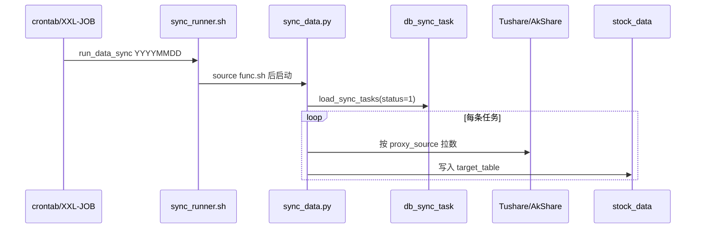

# stock_data — XXL-JOB 调度执行顺序

> 维护日期：2026-07-15  
> 项目路径（服务器）：`/opt/stock_data`  
> 执行前统一：`cd /opt/stock_data && source dw-utils/func.sh`  
> **表结构真相源**：[`mysql_tables/stock_data.sql`](mysql_tables/stock_data.sql)（ETL 脚本内 `CREATE IF NOT EXISTS` 与之对齐）  
> **现网链路**：仅东财 DC（同花顺 / 申万 / AI 核心池脚本已删除；对应 ODS sync `status=0`）

**XXL-JOB 建议**

- 任务类型：BEAN / GLUE(Shell) 均可；推荐直接调用仓库脚本（见第三节）
- 调度参数：可传 `${n_date}`（`YYYYMMDD`），不传则默认当天
- 建议 Cron：交易日 **22:30**（收盘后 Tushare / 东财热榜数据较全）
- 失败告警：依赖 exit code；`run_ods_completeness_monitor` 返回 1 表示 ODS 有 ALERT
- Web 展示默认端口：**8082**（`industry_fund_flow`，避免与 XXL-JOB 8080 冲突）

**相关文档**

- [需求1-主线板块确认-需求文档.md](需求整理/需求1-主线板块确认-需求文档.md) — 主线榜业务与验收
- 补跑：`tmp/xxl_backfill_metric_fix.sh`（指标口径回填）

---

## 〇、ODS 同步分层（`run_data_sync`）

| 层级 | 位置 | 职责 |
|------|------|------|
| 任务定义 | `db_sync_task`（配置库） | 数据源、`target_table`、`sync_mode`、`status` |
| 触发 | crontab / XXL-JOB | 每日调用 `run_data_sync` |
| 执行 | `dw-sync/sync_runner.sh` → `sync_data.py` | 读配置 → 拉数 → 写 `stock_data` |



**依赖安装（服务器首次）**

```bash
cd /opt/stock_data && source dw-utils/func.sh
install_sync_deps
${PYTHON_BIN} -c "import pymysql, pandas, sqlalchemy, akshare; print('ok')"
```

**ODS 手工同步**

```bash
source dw-utils/func.sh
run_data_sync                          # 全部 status=1 任务
run_data_sync 20260616                 # 指定业务日
run_data_sync --source-table daily_basic --force
run_data_sync --dry-run                # 预览不写库
```

**新增 ODS 任务**：在 `db_sync_task` 插入记录，配置 `fetch_config` / `transform_config`（JSON）。占位符：`$trade_date`、`$full_start`、`$full_end`。停用：`UPDATE db_sync_task SET status=0 WHERE id=...`。

**财务指标回补**（景气 DWM 前置，脚本 `dw-sync/sync_ods_fina_indicator.sh`）：

```bash
bash dw-sync/sync_ods_fina_indicator.sh
# 或: bash dw-sync/sync_ods_fina_indicator.sh --start 20250101 --end 20260630
```

**查看同步配置与结果**

```bash
${data_config} -e "SELECT id, proxy_source, source_table, target_table, sync_mode, status FROM db_sync_task;"
${data_mysql} -e "SELECT COUNT(*) FROM ods_trading_day;"
```

---

## 一、任务拆分建议

XXL-JOB 管理台可建多个 Job，也可合并为单个日批（见第三节）。

| Job 名称 | Cron 示例（Linux crontab） | 脚本 | 说明 |
|----------|---------------------------|------|------|
| `stock_daily_all` | `30 22 * * 1-5` | **`dw-utils/xxl_daily_batch.sh`** | **推荐：日批一键（仅东财）** |
| `stock_ods_monthly` | `0 21 1 * *` | `dw-utils/xxl_monthly_batch.sh` | 当前为空跑 SKIP（财报/公司 sync 已停） |
| `stock_dim_etf_weekly` | `0 3 * * 1` | `dw-utils/xxl_weekly_batch.sh` | 每周一：ETF 映射 |
| `stock_mainline_only` | 手工 / 补跑 | `dw-utils/xxl_mainline_batch.sh` | 仅东财主线 DWM+DWS |
| `stock_metric_fix_backfill` | 手工 | `tmp/xxl_backfill_metric_fix.sh` | 指标口径修复回填 |
| `stock_rotation_signal` | 日批内 / 手工 | `dw-dwm/pro_dwm_rotation_signal_di.sh` | 申万板块轮动信号（依赖 sw_daily） |

> **Quartz（XXL-JOB）对照**：日批 `0 30 22 ? * MON-FRI`；月批 `0 0 21 1 * ?`；周批 `0 0 3 ? * MON`。

---

## 二、日批标准顺序

有依赖，请勿乱序。

| 步骤 | 任务 | 依赖 | 产品 |
|------|------|------|------|
| ① | `run_data_sync` | `status=1` 的 ODS（个股行情/指标/资金流、东财板块、`limit_list`、`index_daily`、`moneyflow_hsgt`、`dc_hot`、`fina_indicator`、`report_rc`、`adj_factor`、`stk_limit`、ETF 等） | 全部 |
| ② | `run_dwm_market_breadth` | `ods_stock_detail_di`、`ods_limit_list_di` | 首页广度 / 情绪 |
| ③ | `run_dwm_dc_industry_fund_flow` | 东财行业资金流 ODS | 需求1 五维 |
| ④ | `run_dwm_dc_industry_trend_strength` | 东财板块日线 + `ods_index_daily_di` | 需求1 五维 |
| ⑤ | `run_dwm_dc_industry_market_heat` | `ods_dc_*` + `ods_dc_hot_di` | 需求1 五维 |
| ⑥ | `run_dwm_dc_industry_diffusion` | 东财成分 + 涨停 + 广度 | 需求1 五维 |
| ⑦ | `run_dwm_dc_industry_prosperity` | 东财成分 + `ods_fina_indicator` + `ods_report_rc_di` | 需求1 五维 |
| ⑧ | `run_dws_dc_industry_mainline_score` + `monitor` | 上述全部 DWM | **需求1 主线榜** |
| ⑨ | `run_vp_batch` | 板块/个股 ODS | 需求5 量价 |
| ⑩ | `run_sector_dragon_batch` | 资金 DWM + 个股 ODS | 需求2 龙头 |
| ⑩.6 | `run_rotation_signal` | `sw_daily` + 东财行业资金流 | 量化选板块 |
| ⑪ | `run_ods_completeness_monitor` | — | ODS 完整度（已停表 `enabled=false`） |

> **已删除链路**：同花顺 / 申万 DWM·DWS、AI 核心池、量化主线（需求3）、量化选股。停同步见 `mysql_tables/migrations/20260715_pause_unused_sync.sql`。  
> **2026-07-16**：恢复 `sw_daily` → `ods_industry_daily_di`（板块轮动），迁移脚本 `mysql_tables/migrations/20260716_restore_sw_daily_sync.sql`。

**需求1 落库表（步骤 ⑧）**

| 表 | 说明 |
|----|------|
| `dws_dc_industry_mainline_score_di` | 东财五维总分、等级、MA3/5/10 |
| `dws_dc_industry_mainline_monitor_di` | 东财监控 Top20、三阶段标签 |

---

## 三、日批一键脚本（推荐）

**仓库脚本**（与下文内容一致，便于版本管理）：

```bash
cd /opt/stock_data
bash dw-utils/xxl_daily_batch.sh          # 今天
bash dw-utils/xxl_daily_batch.sh 20260616 # 指定业务日
```

**XXL-JOB GLUE Shell 执行体**（等价）：

```bash
#!/bin/bash
set -euo pipefail
cd /opt/stock_data
bash dw-utils/xxl_daily_batch.sh "${1:-$(date +%Y%m%d)}"
```

脚本全文见 [`dw-utils/xxl_daily_batch.sh`](dw-utils/xxl_daily_batch.sh)。

---

## 四、月批脚本

月批任务已停用（`stock_company` / 三表财报 VIP / `fina_mainbz*` 均为 `status=0`）。脚本保留为空跑 stub，XXL 任务可删或保留无害：

```bash
cd /opt/stock_data
bash dw-utils/xxl_monthly_batch.sh   # 仅打印 SKIP
```

---

## 五、周批脚本（可选，建议开启）

用于刷新 `dim_industry_etf_map`（自动 `index_match`），支撑需求1 **机构化**阶段判定；**不依赖手工维护**，手工 `manual` 映射仅作补强。

```bash
cd /opt/stock_data
bash dw-utils/xxl_weekly_batch.sh
```

脚本见 [`dw-utils/xxl_weekly_batch.sh`](dw-utils/xxl_weekly_batch.sh)。

---

## 六、排障 / 补跑

```bash
cd /opt/stock_data && source dw-utils/func.sh

# 只同步 ODS 某一表
run_data_sync 20260616 --source-table daily_basic --force

# ODS 区间补数
run_data_sync_range 20250101 20260615 --source-table daily_basic --force

# 只跑需求1 主线（ODS + 五维 DWM 已齐）
bash dw-utils/xxl_mainline_batch.sh 20260616
bash dw-utils/xxl_mainline_batch.sh 20250601 20260616   # 区间补 MA

# 指标口径修复回填（breadth→fund→trend→score→monitor→vp→dragon）
bash tmp/xxl_backfill_metric_fix.sh 20250701 20260714
bash tmp/xxl_backfill_metric_fix.sh 20250701 20260714 score,monitor,vp,dragon

# DWS 区间（更细粒度）
bash dw-dws/pro_dws_dc_industry_mainline_score_di.sh 20250601 20260616
bash dw-dws/pro_dws_dc_industry_mainline_monitor_di.sh 20250601 20260616

# 只跑板块龙头（需求2）
run_sector_dragon_batch 20260616

# DWM 历史区间
bash dw-dwm/pro_dwm_dc_industry_market_heat_di.sh 20250101 20260615
```

**日志路径**：`${STOCK_LOG_DIR:-/opt/stock_data/log/stock_log}/${n_date}/`

---

## 七、各步骤是否必须？

| 步骤 | 必须？ | 说明 |
|------|--------|------|
| `run_data_sync` | 是* | 下游 DWM 都依赖当日 ODS；*热榜建议 22:30 后 |
| DWM / DWS 主线（⑧） | **需求1 要** | 不做 `/dc/mainline` 可不跑 |
| `run_vp_batch` / `run_sector_dragon_batch` | 需求5 / 2 要 | 量价 / 龙头页 |
| `xxl_weekly_batch` | 建议 | 提升「机构化」命中率 |
| `run_ods_completeness_monitor` | 建议 | 生产环境 ODS 完整度告警 |

---

## 八、启动报表页面（Web）

> **与日批分离**：报表 Web **不写入** `xxl_daily_batch.sh` / `func.sh`，仅在本节文档维护启动命令；日批只负责写 `stock_data` 数仓。

报表由 **`industry_fund_flow`**（FastAPI + uvicorn）提供。默认端口 **8082**（避开 XXL-JOB 8080）。

### 8.1 首次部署（服务器执行一次）

```bash
cd /opt/stock_data

# 1) 用户库 + stock_data 只读授权
mysql -u root -p < mysql_tables/data_industry_grants.sql
mysql -u root -p < industry_fund_flow/sql/stock_read_grants.sql

# 2) 初始化登录用户表（data_industry.app_user）
source dw-utils/func.sh
init_data_industry_schema

# 3) 生产环境必设 JWT 密钥（写入 func.sh 或 export）
export IFF_JWT_SECRET="$(openssl rand -hex 32)"
```

| 库 | 用途 | 连接变量 |
|----|------|----------|
| `data_industry` | 注册 / 登录 | `IFF_MYSQL_*`（func.sh 从 `INDUSTRY_MYSQL_*` 导出） |
| `stock_data` | 板块 / 主线 / 龙头 / AI 核心池 | `STOCK_MYSQL_*` → Web 侧 `IFF_STOCK_MYSQL_*` |

### 8.2 启动 / 重启

Web **不纳入日批 / XXL-JOB**，需单独手工或 systemd 维护；以下命令复制即用。

**依赖（首次）**

```bash
cd /opt/stock_data
source dw-utils/func.sh
"${PYTHON_BIN}" -m pip install -r industry_fund_flow/requirements.txt
```

**开发 / 调试（前台）**

```bash
cd /opt/stock_data
source dw-utils/func.sh
export IFF_JWT_SECRET="$(openssl rand -hex 32)"   # 生产必设

cd industry_fund_flow
"${PYTHON_BIN}" -m uvicorn app.main:app --host 0.0.0.0 --port 8082 --reload
```

**生产（后台）**

```bash
cd /opt/stock_data
source dw-utils/func.sh
export IFF_JWT_SECRET="$(openssl rand -hex 32)"
mkdir -p /root/log/stock_log/web

pkill -f "uvicorn app.main:app" 2>/dev/null || true

cd industry_fund_flow
nohup "${PYTHON_BIN}" -m uvicorn app.main:app \
  --host 0.0.0.0 --port 8082 \
  >> /root/log/stock_log/web/industry_fund_flow.log 2>&1 &

sleep 1
curl -s -o /dev/null -w "%{http_code}\n" "http://127.0.0.1:8082/login"
# 期望 200
```

| 环境变量 | 默认 | 说明 |
|----------|------|------|
| `IFF_PORT` | `8082` | 启动时 `--port`；与 XXL-JOB 8080 冲突可改 8083 |
| `IFF_JWT_SECRET` | — | **生产必设**，否则重启后登录态失效 |
| `STOCK_MYSQL_*` | func.sh 导出 | 读 `stock_data`；`source func.sh` 后自动可用 |

外网访问需在安全组 / 防火墙放行 `8082`（或实际端口）。登录 Cookie 名：**`iff_token`**。

### 8.3 报表页面与日批依赖

日批完成后访问对应页面；**无数据时先查第二节步骤是否已跑、再查 §8.5 SQL**。

| 页面 | URL | 日批步骤 | 主要读表 |
|------|-----|----------|----------|
| 首页（市场广度 / 情绪） | `/` | ② + HSGT ODS | `dwm_market_breadth_di` 等 |
| **资金强度** | `/dc/fund-flow` | ③ | `dwm_dc_industry_fund_flow_di` |
| **主线板块**（需求1） | `/dc/mainline` | ⑧ | `dws_dc_industry_mainline_monitor_di` |
| **板块量价**（需求5） | `/dc/vp` | ⑨ | `dwm_industry_vp_score_di` 等 |
| **板块龙头**（需求2） | `/dc/dragon` | ⑩ | `dwm_sector_stock_dragon_score_di` 等 |
| 登录 / 注册 | `/login` `/register` | — | `data_industry.app_user` |

导航栏与各 `/dc/{slug}` 页共用 [`dc_registry.py`](industry_fund_flow/app/dc_registry.py) 注册（五维单页可已下架导航，ETL 仍写库供主线）。

**推荐访问顺序（收盘后）**

1. 等日批 `xxl_daily_batch.sh` 跑完（或 XXL-JOB `stock_daily_all` 成功）
2. 浏览器打开 `http://<host>:8082/login` 登录
3. 首页看情绪/广度 → 资金强度 → 主线板块 → 板块量价 → 板块龙头

### 8.4 API 速查（需登录 Cookie）

| 方法 | 路径 | 说明 |
|------|------|------|
| GET | `/api/me` | 当前用户 |
| GET | `/api/v1/mainline/rank?trade_date=YYYYMMDD&top=20` | 需求1 主线榜 |
| GET | `/api/v1/mainline/history?industry_code=BKxxxx.DC&days=60` | 主线历史得分 |
| GET | `/api/v1/dragon/leaders?trade_date=YYYYMMDD` | 需求2 龙头摘要 |
| GET | `/api/dc/{slug}?trade_date=YYYYMMDD` | 五维 DWM 通用榜单 |

命令行测 API（先登录拿 Cookie）：

```bash
curl -c cookies.txt -b cookies.txt -X POST "http://127.0.0.1:8082/login" \
  -d "username=你的用户&password=你的密码" -L -s -o /dev/null

curl -b cookies.txt -s "http://127.0.0.1:8082/api/v1/mainline/rank?top=20" | python3 -m json.tool
```

### 8.5 页面无数据速查 SQL

将 `@d` 换成实际交易日（`YYYY-MM-DD`）。

```sql
USE stock_data;
SET @d = '2026-06-26';

SELECT 'mainline' AS page, COUNT(*) FROM dws_dc_industry_mainline_monitor_di WHERE trade_date = @d
UNION ALL SELECT 'dragon', COUNT(*) FROM dwm_sector_stock_dragon_score_di WHERE trade_date = @d
UNION ALL SELECT 'vp', COUNT(*) FROM dwm_industry_vp_score_di WHERE trade_date = @d;
```

| 页面空 | 常见原因 |
|--------|----------|
| 主线榜 | 日批 ⑧ 未跑；`stock_read_grants.sql` 未执行 |
| 板块龙头 | 日批 ⑩ 未跑；成分 `<3` 的板块被跳过 |
| 板块量价 | 日批 ⑨ 未跑 |
| 量化信号 | 日批 ⑩.5 未跑；策略未启用 |

Web 日志：`${STOCK_LOG_DIR:-/opt/stock_data/log/stock_log}/web/industry_fund_flow.log`

---

## 九、需求1 数据验收（SQL 速查）

将 `@d` 换成实际交易日（`YYYY-MM-DD`）。

```sql
USE stock_data;
SET @d = '2026-06-13';

-- 五维 DWM 是否有数
SELECT 'fund' AS dim, COUNT(*) FROM dwm_dc_industry_fund_flow_di WHERE trade_date = @d
UNION ALL SELECT 'trend', COUNT(*) FROM dwm_dc_industry_trend_strength_di WHERE trade_date = @d
UNION ALL SELECT 'heat', COUNT(*) FROM dwm_dc_industry_market_heat_di WHERE trade_date = @d
UNION ALL SELECT 'diffusion', COUNT(*) FROM dwm_dc_industry_diffusion_di WHERE trade_date = @d
UNION ALL SELECT 'prosperity', COUNT(*) FROM dwm_dc_industry_prosperity_di WHERE trade_date = @d;

-- 主线 Top10
SELECT rank_no, industry_name, main_score, mainline_level, mainline_stage
FROM dws_dc_industry_mainline_monitor_di
WHERE trade_date = @d AND content_type = '行业' AND is_top20 = 1
ORDER BY rank_no LIMIT 10;

-- 三阶段分布（「机构化」可能为 0，见已知限制）
SELECT mainline_stage, COUNT(*) AS cnt
FROM dws_dc_industry_mainline_monitor_di
WHERE trade_date = @d
GROUP BY mainline_stage;
```

**已知限制**：「机构化」依赖 `dim_industry_etf_map`（周批自动）+ `ods_etf_share_size_di` + 东财板块名与申万行业名模糊匹配；概念板块常无样本，**无手工维护可接受**，不影响主线榜主体验收。

**API 快速测**（先登录拿 Cookie，详见 §八.4）：

```bash
curl -c cookies.txt -b cookies.txt -X POST "http://127.0.0.1:8082/login" \
  -d "username=你的用户&password=你的密码" -L -s -o /dev/null

curl -b cookies.txt -s "http://127.0.0.1:8082/api/v1/mainline/rank?top=20" | python3 -m json.tool
curl -b cookies.txt -s "http://127.0.0.1:8082/api/me"
```

---

## 十、ODS 同步备忘（2026-07 现状）

**仍在同步（`status=1`）**：个股 `daily`/`daily_basic`/`moneyflow`、东财 `dc_*`/`moneyflow_ind_dc`/`dc_hot`、`limit_list_d`、`index_daily`、`moneyflow_hsgt`、`fina_indicator_vip`、`report_rc`、`adj_factor`、`stk_limit`、ETF、交易日历、`index_classify`、`stock_basic` 等。

**已停用（`status=0`）**：同花顺、申万日线/成分、筹码、主营构成、融资融券、龙虎榜、股东、三表财报 VIP、公司信息等。详见 `mysql_tables/migrations/20260715_pause_unused_sync.sql`。

---

## 十一、仓库脚本索引

| 文件 | 说明 |
|------|------|
| [`mysql_tables/stock_data.sql`](mysql_tables/stock_data.sql) | **数仓 DDL 真相源** |
| [`dw-utils/func.sh`](dw-utils/func.sh) | MySQL 环境、`run_data_sync`、东财 DWM/DWS 封装 |
| [`dw-sync/sync_runner.sh`](dw-sync/sync_runner.sh) | ODS 同步入口 |
| [`dw-sync/sync_data.py`](dw-sync/sync_data.py) | 配置驱动同步 |
| [`dw-utils/xxl_daily_batch.sh`](dw-utils/xxl_daily_batch.sh) | 日批一键（仅东财） |
| [`dw-utils/xxl_monthly_batch.sh`](dw-utils/xxl_monthly_batch.sh) | 月批（当前 SKIP stub） |
| [`dw-utils/xxl_weekly_batch.sh`](dw-utils/xxl_weekly_batch.sh) | 周批 ETF 映射 |
| [`dw-utils/xxl_mainline_batch.sh`](dw-utils/xxl_mainline_batch.sh) | 仅需求1 补跑 |
| [`tmp/xxl_backfill_metric_fix.sh`](tmp/xxl_backfill_metric_fix.sh) | 指标口径修复回填 |
| [`dw-monitor/pro_ods_completeness.sh`](dw-monitor/pro_ods_completeness.sh) | ODS 完整度监控 |
| [`dw-dwm/pro_dwm_*`](dw-dwm/) | 东财 DWM + 量价/龙头 |
| [`dw-dws/pro_dws_*`](dw-dws/) | 东财主线评分/监控 |
| [`industry_fund_flow/README.md`](industry_fund_flow/README.md) | 报表 Web 说明 |

---

## 十二、常见问题

| 现象 | 排查 |
|------|------|
| 任务成功但表无数据 | AkShare/Tushare 是否返回空；`run_data_sync --dry-run` 看行数 |
| `Access denied` | 检查 `dw-utils/func.sh` 中 MySQL 账号 |
| 1045 / 变量未加载 | 先 `source dw-utils/func.sh` 或走 `sync_runner.sh` |
| Web 主线榜空 | 确认日批 ⑧ 已跑、`stock_read_grants.sql` 已执行（§八.5） |
| Web 无法访问 | 检查 uvicorn 进程、端口 8082、安全组（启动见 §八.2） |
| uvicorn 端口占用 | 换 `--port 8083` 或 `pkill -f "uvicorn app.main:app"` 后重启 |
| 完整度 ALERT 误报 | 确认 `ods_checks.json` 中已停表为 `enabled:false` |
