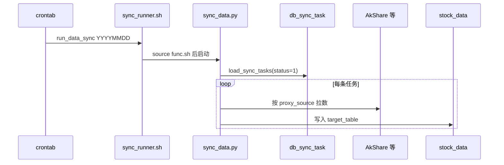

# stock_data 调度执行流程

Linux 项目路径示例：`/root/stock_data`

任务定义在 `data_config.db_sync_task`；**触发时间**由系统 **crontab** 或手工 `run_data_sync` 控制。

---

## 1. 调度分层

| 层级 | 存放位置 | 职责 |
|------|----------|------|
| **任务定义** | `db_sync_task`（配置库） | 数据源、目标表、`sync_mode`、`status` |
| **触发时间** | 服务器 crontab | 每日几点执行 `run_data_sync` |
| **执行入口** | `dw-sync/sync_runner.sh` | 读配置 → `sync_data.py` → 写业务库 |



---

## 2. 依赖安装

```bash
cd /root/stock_data
source dw-utils/func.sh

install_sync_deps

${PYTHON_BIN} -c "import pymysql, pandas, sqlalchemy, akshare; print('ok', ${PYTHON_BIN})"
```

---

## 3. 执行同步

```bash
source dw-utils/func.sh

# 跑全部 status=1 任务
run_data_sync

# 指定业务日期
run_data_sync $(date +%Y%m%d)

# 仅某一接口（对应 db_sync_task.source_table）
run_data_sync --source-table tool_trade_date_hist_sina

# 仅预览不写库
run_data_sync --dry-run
```

等价直接调用：

```bash
bash dw-sync/sync_runner.sh 20260525 --source-table tool_trade_date_hist_sina
```

---

## 4. crontab 示例

```cron
# 每天 08:00 同步全部启用任务（含交易日历等）
0 8 * * * cd /root/stock_data && bash -lc 'source dw-utils/func.sh && run_data_sync $(date +\%Y\%m\%d)' >> /var/log/stock_data_sync.log 2>&1
```

按需增加多条，或用 `--source-table` 拆分时段。

---

## 5. 运行结果查看

```bash
source dw-utils/func.sh

${data_config} -e "SELECT id, proxy_source, source_table, target_table, sync_mode, status FROM db_sync_task;"

${data_mysql} -e "SELECT COUNT(*) AS cnt FROM ods_trading_day;"
```

---

## 6. 任务变更

| 需求 | 操作 |
|------|------|
| 停用任务 | `UPDATE db_sync_task SET status=0 WHERE id=...;` |
| 新增任务 | `INSERT INTO db_sync_task ...`，并在 `dw-sync/task_registry.py` 注册处理器 |
| 改执行时间 | 修改 crontab |
| 补历史 | `run_data_sync 20260501 --source-table xxx` |

---

## 7. 常见问题

| 现象 | 排查 |
|------|------|
| 任务成功但表无数据 | AkShare 是否返回空；`--dry-run` 看行数 |
| `Access denied` | 检查 `dw-utils/func.sh` 中 MySQL 账号 |
| 1045 / 配置未加载 | 须 `source dw-utils/func.sh` 或走 `sync_runner.sh` |

---

## 8. 相关文件

| 文件 | 说明 |
|------|------|
| `dw-utils/func.sh` | 正式环境 MySQL、`run_data_sync` |
| `dw-sync/sync_runner.sh` | 同步入口 |
| `dw-sync/sync_data.py` | 配置驱动同步 |
| `mysql_tables/data_config.sql` | `db_sync_task` 表结构 |
