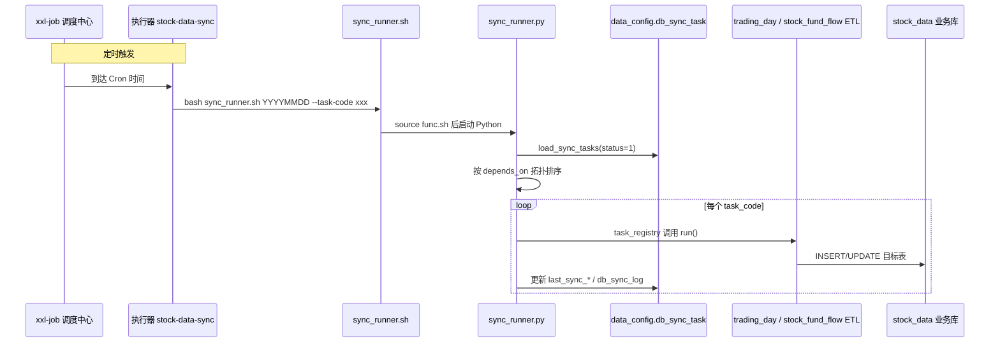

# stock_data 调度执行流程

Linux 项目路径：`/root/stock_data`

本文说明 **何时、由谁触发** 同步任务。任务内容与目标表在 `data_config.db_sync_task` 配置；**cron 时间在 xxl-job** 配置（不在 `db_sync_task`）。

---

## 1. 调度分层

| 层级 | 存放位置 | 职责 |
|------|----------|------|
| **任务定义** | `data_config.db_sync_task` | 跑什么、写哪张表、`script_args`、依赖关系、`status` 开关 |
| **触发时间** | `xxl_job.xxl_job_info` | 几点跑、跑哪个 `--task-code` |
| **执行入口** | `sync/sync_runner.sh` | 读配置表 → 调 ETL → 写 `db_sync_log` |



---

## 2. 当前定时计划（xxl-job）

导入 SQL：`mysql_tables/xxl_job_stock_sync.sql`  
执行器 AppName：**`stock-data-sync`**

| 任务描述 | task_code | Cron（Quartz） | 说明 |
|----------|-----------|----------------|------|
| 交易日维度 | `trading_day` | `0 0 8 * * ?` | 每天 08:00 |
| 个股资金流（即时） | `stock_fund_flow` | `0 0 19 ? * MON-FRI` | 周一至五 19:00 |

**日内顺序建议**：先 08:00 生成 `trading_day_di`，再 19:00 拉 `stock_fund_flow_di`（配置里 `stock_fund_flow` 依赖 `trading_day`）。

---

## 3. xxl-job 部署流程

### 3.1 前置条件

- xxl-job-admin 已启动（示例：`http://服务器:8080/xxl-job-admin`）
- MySQL 存在库 `xxl_job`，账号见 `utils/func.sh` 中 `XXL_MYSQL_*`
- 同步代码在 `/root/stock_data`，Python 依赖已安装（见下方「依赖安装」）

### 依赖安装

服务器 Python：`/usr/local/bin/python3.11`（交互式 `alias python=...` 对脚本无效，`func.sh` 已默认使用该路径）。

```bash
cd /root/stock_data
source utils/func.sh

# 一键安装（推荐）
install_sync_deps

# 或手工
/usr/local/bin/python3.11 -m pip install -r requirements.txt -i https://pypi.tuna.tsinghua.edu.cn/simple

# 验证
${PYTHON_BIN} -c "import pymysql, pandas, sqlalchemy, akshare; print('ok', ${PYTHON_BIN})"
```

### 3.2 导入调度任务到数据库

```bash
cd /root/stock_data
source utils/func.sh
init_xxl_job_stock_sync
```

或在管理台手工新建任务，Glue 脚本与 SQL 中一致（见第 6 节）。

### 3.3 配置执行器

在 **部署 sync 的同一台机器**（或能访问 MySQL、AkShare 的机器）启动 xxl-job-executor，关键配置：

```properties
# 与 xxl_job_group.app_name 一致
xxl.job.executor.appname=stock-data-sync
xxl.job.admin.addresses=http://127.0.0.1:8080/xxl-job-admin
xxl.job.accessToken=你的token
```

环境变量（执行器进程级或 Glue 前 export）：

```bash
export STOCK_DATA_ROOT=/root/stock_data
export PYTHON_BIN=/usr/bin/python3   # 可选，有 venv 时指向 venv
```

### 3.4 管理台确认

1. **执行器管理** → 看到 `stock-data-sync` 在线  
2. **任务管理** → 两条 `[stock_sync]` 任务状态为 **运行**  
3. **执行一次** → 点「执行」做冒烟测试  
4. **调度日志** → 查看成功/失败与 stdout

---

## 4. 手工调度（不经过 xxl-job）

与定时任务走 **同一入口**，便于补数、排错。

```bash
cd /root/stock_data
source utils/func.sh

# 等价于 xxl 08:00 任务
run_data_sync $(date +%Y%m%d) --task-code trading_day

# 等价于 xxl 19:00 任务
run_data_sync $(date +%Y%m%d) --task-code stock_fund_flow

# 一次跑完所有 status=1 的任务（按依赖排序）
run_data_sync $(date +%Y%m%d)

# 只预览
run_data_sync --dry-run
```

---

## 5. 一次完整调度执行过程（以 stock_fund_flow 为例）

1. xxl-job 触发 GLUE(Shell) 脚本  
2. 脚本执行：`bash /root/stock_data/sync/sync_runner.sh 20260519 --task-code stock_fund_flow`  
3. `sync_runner.sh` → `source utils/func.sh`（注入 MySQL 环境变量）  
4. `sync_runner.py`：  
   - 连接 `data_config`，读取 `db_sync_task`（`status=1`）  
   - 若只指定 `--task-code`，仅加载该任务（依赖项需在列表内才会被拓扑执行；单独跑 `stock_fund_flow` 时假定 `trading_day` 已由 08:00 任务完成）  
5. `task_registry.run_stock_fund_flow`：  
   - `target_database` / `target_table` 来自配置表  
   - `script_args.periods` → 仅 `["即时"]`  
   - 调用 AkShare → 写入 `stock_data.stock_fund_flow_di`  
6. 更新 `db_sync_task.last_sync_status`、`last_sync_time`  
7. 插入 `db_sync_log`（含 `run_id`、行数、错误信息）

---

## 6. xxl-job Glue 脚本参考

**trading_day（每天 08:00）**

```bash
#!/bin/bash
set -euo pipefail
ROOT="${STOCK_DATA_ROOT:?请配置 STOCK_DATA_ROOT}"
TD="$(date +%Y%m%d)"
exec bash "${ROOT}/sync/sync_runner.sh" "${TD}" --task-code trading_day
```

**stock_fund_flow（工作日 19:00）**

```bash
#!/bin/bash
set -euo pipefail
ROOT="${STOCK_DATA_ROOT:?请配置 STOCK_DATA_ROOT}"
TD="$(date +%Y%m%d)"
exec bash "${ROOT}/sync/sync_runner.sh" "${TD}" --task-code stock_fund_flow
```

---

## 7. 运行结果查看

```bash
source /root/stock_data/utils/func.sh

# 任务配置与最近状态
${data_config} -e "
  SELECT task_code, status, last_sync_status, last_sync_time, last_error_msg
  FROM db_sync_task;
"

# 最近执行日志
${data_config} -e "
  SELECT run_id, task_code, status, rows_affected, started_at, finished_at, error_msg
  FROM db_sync_log
  ORDER BY started_at DESC
  LIMIT 20;
"

# 业务表行数（示例）
${data_mysql} -e "
  SELECT COUNT(*) AS cnt FROM stock_fund_flow_di WHERE trade_date = CURDATE();
"
```

---

## 8. 修改调度

| 需求 | 操作 |
|------|------|
| 改执行时间 | xxl-job 管理台改 Cron，或改 `xxl_job_stock_sync.sql` 后重新 `init_xxl_job_stock_sync` |
| 停用某任务 | `UPDATE db_sync_task SET status=0 WHERE task_code='...';` 并在 xxl-job 停止对应任务 |
| 新增定时任务 | 先在 `db_sync_task` + `task_registry` 增加任务，再在 xxl-job 增加 GLUE 任务 |
| 临时补历史日期 | `run_data_sync 20260501 --task-code stock_fund_flow` |

---

## 9. 常见问题

| 现象 | 排查 |
|------|------|
| 执行器离线 | 检查 executor 进程、`appname`、admin 地址、防火墙 |
| `请配置 STOCK_DATA_ROOT` | 执行器环境变量未设置 |
| 任务成功但表无数据 | 查 `db_sync_log`、AkShare 是否返回空、是否非交易日 |
| `Access denied` data_config | 先初始化 MySQL 用户，见 `mysql_tables/init_mysql_grants.sql` |
| 1045 / 配置未加载 | 禁止直接 `python sync_runner.py`，须走 `sync_runner.sh` |

---

## 10. 相关文件

| 文件 | 说明 |
|------|------|
| `utils/func.sh` | `run_data_sync`、`init_xxl_job_stock_sync` |
| `sync/sync_runner.sh` | 调度执行入口 |
| `mysql_tables/data_config.sql` | 任务配置表 |
| `mysql_tables/xxl_job_stock_sync.sql` | xxl-job 任务 SQL |
