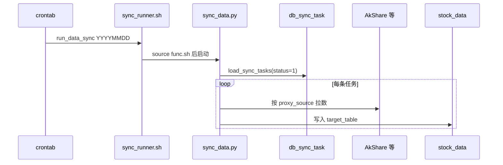

# stock_data 调度执行流程

Linux 项目路径示例：`/root/stock_data`

任务定义在 `data_config.db_sync_task`；**触发时间**由系统 **crontab** 或手工 `run_data_sync` 控制。

---

## 1. 调度分层

| 层级 | 存放位置 | 职责 |
|------|----------|------|
| **任务定义** | `db_sync_task`（配置库） | 数据源、目标表、`sync_mode`、`status` |
| **触发时间** | 服务器 crontab | 每日几点执行 `run_data_sync` |
| **执行入口** | `dw-sync/sync_runner.sh` | 读配置 → `sync_data.py` → 写业务库 |



---

## 2. 依赖安装

```bash
cd /root/stock_data
source dw-utils/func.sh

install_sync_deps

${PYTHON_BIN} -c "import pymysql, pandas, sqlalchemy, akshare; print('ok', ${PYTHON_BIN})"
```

---

## 3. 执行同步

```bash
source dw-utils/func.sh

# 跑全部 status=1 任务
run_data_sync

# 指定业务日期
run_data_sync $(date +%Y%m%d)

# 仅某一接口（对应 db_sync_task.source_table）
run_data_sync --source-table tool_trade_date_hist_sina

# 仅预览不写库
run_data_sync --dry-run
```

等价直接调用：

```bash
bash dw-sync/sync_runner.sh 20260525 --source-table tool_trade_date_hist_sina
```

---

## 5. 运行结果查看

```bash
source dw-utils/func.sh

${data_config} -e "SELECT id, proxy_source, source_table, target_table, sync_mode, status FROM db_sync_task;"

${data_mysql} -e "SELECT COUNT(*) AS cnt FROM ods_trading_day;"
```

---

## 6. 新增任务（通用配置，一般不改代码）

在 `db_sync_task` 插入记录，配置 `fetch_config`（怎么拉）和 `transform_config`（怎么映射）：

**fetch_config 示例**

```json
{
  "token_type": "tushare",
  "exchange_list": ["SSE", "SZSE"],
  "date_range": {
    "full": {"start_date": "19900101", "end_date": "$today_plus_365"},
    "day": {"start_date": "$trade_date", "end_date": "$trade_date"}
  },
  "inject_date_range": true,
  "params": {"limit": 5000}
}
```

或显式多次调用：`"calls": [{"params": {"exchange": "SSE"}}, {"params": {"exchange": "SZSE"}}]`

占位符：`$trade_date`、`$full_start`、`$full_end`、`$today_plus_365`（与 `sync_mode` 联动）。

**transform_config 示例**

```json
{
  "rename": {"cal_date": "trade_date"},
  "date_columns": {"trade_date": "%Y%m%d", "pretrade_date": "%Y%m%d"},
  "keep_columns": ["exchange", "trade_date", "is_open", "pretrade_date"],
  "dedupe": ["exchange", "trade_date"],
  "dropna": ["trade_date"]
}
```

AkShare 无参全量只需：`fetch_config: {}`，`transform_config` 里指定 `keep_columns` / `dedupe` 即可。

| 需求 | 操作 |
|------|------|
| 停用任务 | `UPDATE db_sync_task SET status=0 WHERE id=...;` |
| 新增任务 | `INSERT` + JSON 配置，`proxy_source` 为 akshare/tushare |
| 改执行时间 | 修改 crontab |
| 补历史 | `run_data_sync 20260501 --source-table xxx` |
| 市场广度 DWM | `run_dwm_market_breadth 20260527` 或 `bash dw-dwm/pro_dwm_market_breadth_di.sh`（依赖当日 `ods_stock_detail_di`、`ods_limit_list_di`） |
| 东财板块资金强度 DWM | `run_dwm_dc_industry_fund_flow 20260527`（依赖 `moneyflow_ind_dc`、`dc_daily`） |
| 同花顺板块资金强度 DWM | `run_dwm_ths_industry_fund_flow 20260527`（依赖 `moneyflow`、`ths_member`、`ths_daily`） |
| 东财/同花顺板块趋势强度 DWM | `run_dwm_dc_industry_trend_strength` / `run_dwm_ths_industry_trend_strength`（依赖板块日线 + `ods_index_daily_di` 沪深300） |
| 产业景气 DWM（东财/同花顺/申万） | `run_dwm_dc_industry_prosperity` / `run_dwm_ths_industry_prosperity` / `run_dwm_sw_industry_prosperity`（依赖成分 + `ods_fina_indicator` + `ods_report_rc_di`） |
| 财务指标历史回补 | `bash dw-tmp/sync_ods_fina_indicator.sh`（默认 20250101 起；景气 DWM 前建议先跑通） |
| 行业-ETF 映射 DIM | `run_dim_industry_etf_map` 或 `bash dw-dim/pro_dim_industry_etf_map.sh`（依赖 `etf_basic`、`index_classify` 已同步） |
| ODS 数据监控 | `run_ods_data_check` 或 `bash dw-monitor/pro_ods_data_check.sh`（交易日检查各 ODS 表；exit 1=有告警） |

---

## 6b. DWM / DIM 日批（`func.sh` 封装）

须先 `source dw-utils/func.sh`。日期参数为 `YYYYMMDD`，无参默认**昨日**；支持区间 `start end`。

```bash
source dw-utils/func.sh
TD=20260609   # 业务交易日

# 1) ODS 同步（见 §3）
run_data_sync "${TD}"

# 2) 市场广度
run_dwm_market_breadth "${TD}"

# 3) 板块资金强度（东财官方 + 同花顺估算）
run_dwm_dc_industry_fund_flow "${TD}"
run_dwm_ths_industry_fund_flow "${TD}"

# 4) 板块趋势强度（RS / 均线多头 / 60 日新高 / 回撤修复）
run_dwm_dc_industry_trend_strength "${TD}"
run_dwm_ths_industry_trend_strength "${TD}"

# 4b) 市场热度（成交额占比等；热榜排名仅透传不参与 heat_rank）
run_dwm_dc_industry_market_heat "${TD}"
run_dwm_ths_industry_market_heat "${TD}"

# 4c) 扩散效应（上涨占比/20cm/晋级率/炸板率等）
run_dwm_dc_industry_diffusion "${TD}"
run_dwm_ths_industry_diffusion "${TD}"
run_dwm_sw_industry_diffusion "${TD}"

# 5) 产业景气（成分股财务 + 卖方预测聚合；policy_score 占位 0）
run_dwm_dc_industry_prosperity "${TD}"
run_dwm_ths_industry_prosperity "${TD}"
run_dwm_sw_industry_prosperity "${TD}"    # 申万 L1/L2/L3

# 6) DWS 五维评分与排名（依赖上述全部 DWM）
run_dws_dc_industry_mainline_score "${TD}"
run_dws_ths_industry_mainline_score "${TD}"
run_dws_sw_industry_mainline_score "${TD}"

# 6b) DWS 主线监控表（依赖评分表 + DWM 因子；默认展示 5 日均分）
run_dws_dc_industry_mainline_monitor "${TD}"
run_dws_ths_industry_mainline_monitor "${TD}"
run_dws_sw_industry_mainline_monitor "${TD}"

# 7) 维表（可周更）
run_dim_industry_etf_map
```

```bash
cd /root/stock_data

source dw-utils/func.sh

n_date=$(date +%Y%m%d)

# 跑全部 status=1 任务
run_data_sync ${n_date}

# 获取全市场涨跌股票信息
bash dw-dwm/pro_dwm_market_breadth_di.sh ${n_date}

# 获取etf和行业板块对应关系
bash dw-dim/pro_dim_industry_etf_map.sh ${n_date}

# 东财行业资金流信息
bash dw-dwm/pro_dwm_dc_industry_fund_flow_di.sh ${n_date}

# 东财行业产业景气
bash dw-dwm/pro_dwm_dc_industry_prosperity_di.sh ${n_date}

# 东财行业趋势强度
bash dw-dwm/pro_dwm_dc_industry_trend_strength_di.sh ${n_date}

# 同花顺行业资金流信息
bash dw-dwm/pro_dwm_ths_industry_fund_flow_di.sh ${n_date}

# 同花顺行业产业景气
bash dw-dwm/pro_dwm_ths_industry_prosperity_di.sh ${n_date}

# 同花顺行业趋势强度
bash dw-dwm/pro_dwm_ths_industry_trend_strength_di.sh ${n_date}

# 申万行业产业景气
bash dw-dwm/pro_dwm_sw_industry_prosperity_di.sh ${n_date}

```

**依赖顺序**：`run_data_sync` → 广度 / 资金 / 趋势 DWM → **产业景气 DWM**（需 `ods_fina_indicator`、`ods_report_rc_di` 有数据）。`ods_fina_indicator` 日 snapshot 按 `ann_date` 增量有限，首次或补 2025 年以来缺口请执行：

```bash
bash dw-tmp/sync_ods_fina_indicator.sh
# 或指定区间：bash dw-tmp/sync_ods_fina_indicator.sh --start 20250101 --end 20260630
```


## 7. 常见问题

| 现象 | 排查 |
|------|------|
| 任务成功但表无数据 | AkShare 是否返回空；`--dry-run` 看行数 |
| `Access denied` | 检查 `dw-utils/func.sh` 中 MySQL 账号 |
| 1045 / 配置未加载 | 须 `source dw-utils/func.sh` 或走 `sync_runner.sh` |

---

## 8. 相关文件

| 文件 | 说明 |
|------|------|
| `dw-utils/func.sh` | 正式环境 MySQL、`run_data_sync` |
| `dw-sync/sync_runner.sh` | 同步入口 |
| `dw-sync/sync_data.py` | 配置驱动同步 |
| `mysql_tables/data_config.sql` | `db_sync_task` 表结构 |
| `dw-dwm/pro_dwm_market_breadth_di.sh` | 全市场广度 DWM ETL |
| `dw-dwm/pro_dwm_dc_industry_fund_flow_di.sh` | 东财板块资金强度 DWM |
| `dw-dwm/pro_dwm_ths_industry_fund_flow_di.sh` | 同花顺板块资金强度 DWM（估算） |
| `dw-dwm/pro_dwm_dc_industry_trend_strength_di.sh` | 东财板块趋势强度 DWM |
| `dw-dwm/pro_dwm_ths_industry_trend_strength_di.sh` | 同花顺板块趋势强度 DWM |
| `dw-dwm/pro_dwm_dc_industry_market_heat_di.sh` | 东财板块市场热度 DWM（热榜字段仅保留） |
| `dw-dwm/pro_dwm_ths_industry_market_heat_di.sh` | 同花顺板块市场热度 DWM（热榜字段仅保留） |
| `dw-dwm/pro_dwm_dc_industry_diffusion_di.sh` | 东财板块扩散效应 DWM |
| `dw-dwm/pro_dwm_ths_industry_diffusion_di.sh` | 同花顺板块扩散效应 DWM |
| `dw-dwm/pro_dwm_sw_industry_diffusion_di.sh` | 申万行业扩散效应 DWM（L1/L2/L3） |
| `dw-dws/pro_dws_dc_industry_mainline_score_di.sh` | 东财板块主线五维评分 DWS |
| `dw-dws/pro_dws_ths_industry_mainline_score_di.sh` | 同花顺板块主线五维评分 DWS |
| `dw-dws/pro_dws_sw_industry_mainline_score_di.sh` | 申万行业主线评分 DWS（L1/L2/L3） |
| `dw-dws/pro_dws_dc_industry_mainline_monitor_di.sh` | 东财板块主线监控表 DWS |
| `dw-dws/pro_dws_ths_industry_mainline_monitor_di.sh` | 同花顺板块主线监控表 DWS |
| `dw-dws/pro_dws_sw_industry_mainline_monitor_di.sh` | 申万行业主线监控表 DWS |
| `dw-dwm/pro_dwm_dc_industry_prosperity_di.sh` | 东财板块产业景气 DWM |
| `dw-dwm/pro_dwm_ths_industry_prosperity_di.sh` | 同花顺板块产业景气 DWM |
| `dw-dwm/pro_dwm_sw_industry_prosperity_di.sh` | 申万行业产业景气 DWM（L1/L2/L3） |
| `dw-tmp/sync_ods_fina_indicator.sh` | `ods_fina_indicator` 按季回补（默认 202501 起） |
| `dw-dim/pro_dim_industry_etf_map.sh` | 行业-ETF 映射 DIM ETL |
| `dw-monitor/pro_ods_data_check.sh` | ODS 层数据缺失监控 |
