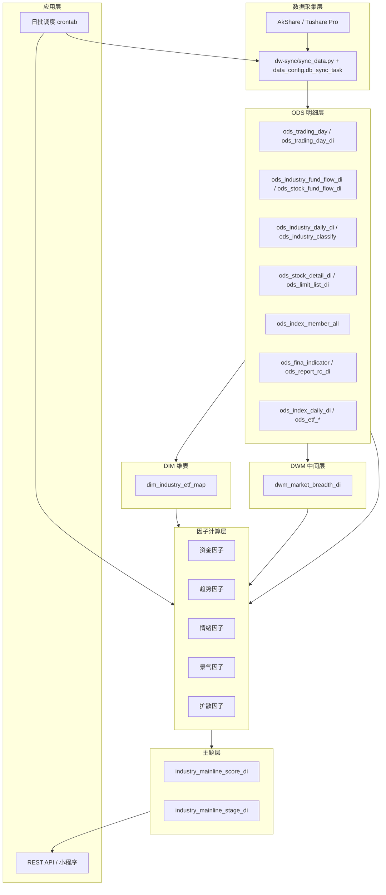
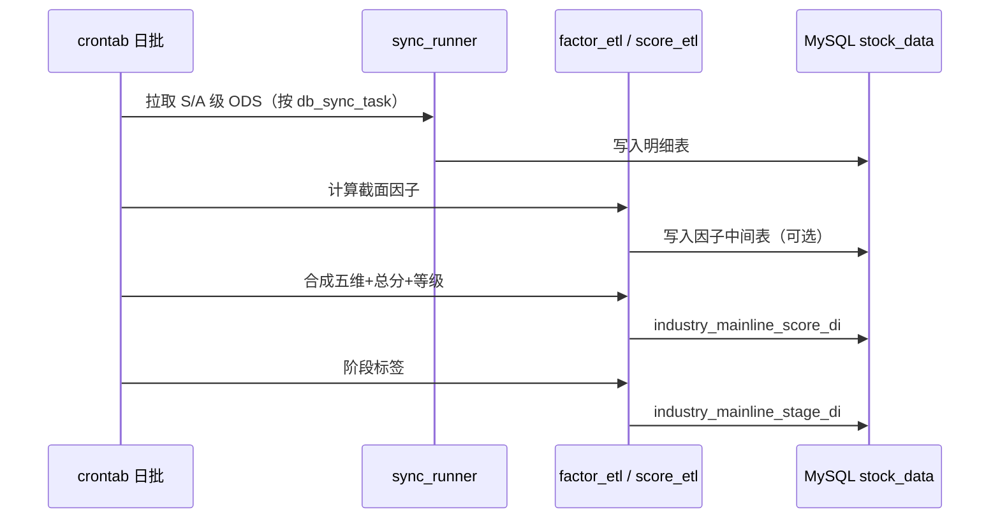

# 需求1：主线板块确认 — 技术文档

> 来源：`industry_indicator_system.xlsx` → Sheet《需求1—主线板块确认》  
> 版本：v1.5  
> 更新日期：2026-05-30

---

## 1. 系统架构



---

## 2. 数据分层（L1–L7）

| 层级 | 内容 | 说明 |
|------|------|------|
| L1 | 股票基础行情 | 所有计算基础 |
| L2 | 行业板块数据 | 行业指数、成分股 |
| L3 | 资金流数据 | 主线识别最核心 |
| L4 | 情绪数据 | 涨停、涨跌家数等 |
| L5 | 基本面/景气数据 | 业绩、ROE 等 |
| L6 | 机构预期数据 | 盈利预测修正 |
| L7 | 宏观数据 | 可选进阶 |

---

## 3. 核心数据表清单

### 3.1 逻辑表名与 ODS 落地对照

本需求文档中的**逻辑表名**（如 `industry_index_di`）与仓库实际落库表名（`ods_*` 前缀）对应关系如下：

| 逻辑表名（需求/因子文档） | 实际 ODS 表名 | 说明 |
|---------------------------|---------------|------|
| `industry_index_di` | `ods_industry_daily_di` | 申万行业指数日线（Tushare `sw_daily`） |
| `industry_fund_flow_di` | `ods_industry_fund_flow_di` | 东财板块资金流向（Tushare `moneyflow_ind_dc`） |
| `stock_fund_flow_di` | `ods_stock_fund_flow_di` | 个股资金流向（Tushare `moneyflow`） |
| `industry_member_di`（分类） | `ods_industry_classify` | 申万行业分类 SW2014/SW2021（**非成分股**） |
| — | `ods_trading_day` / `ods_trading_day_di` | 交易日历（AkShare / Tushare `trade_cal`） |
| `stock_daily_di` | `ods_stock_detail_di` | A 股日线（Tushare `daily`） |
| `limit_up_di` | `ods_limit_list_di` | 涨跌停/炸板（Tushare `limit_list_d`，U/D/Z） |
| `market_breadth_di` | `dwm_market_breadth_di` | 全市场广度（逻辑名不变；由 ODS 聚合，见 §3.5） |
| `industry_member_di`（成分） | `ods_index_member_all` | 申万成分分级（Tushare `index_member_all`） |
| —（ETF 行业映射） | `dim_industry_etf_map` | 行业↔ETF 维表（ETL 生成 + 可人工 `manual`） |
| `financial_indicator_di` | `ods_fina_indicator` | 财务指标（Tushare `fina_indicator_vip`） |
| `institution_forecast_di` | `ods_report_rc_di` | 卖方盈利预测（Tushare `report_rc`） |
| —（RS 基准） | `ods_index_daily_di` | 指数日线（Tushare `index_daily`，含沪深300） |
| `etf_flow_di`（份额层） | `ods_etf_share_size_di` | ETF 份额/规模（Tushare `etf_share_size`） |
| —（ETF 映射） | `ods_etf_basic_di` | ETF 基础信息与跟踪指数（Tushare `etf_basic`） |

下文因子计算、字段设计在引用「来源表」时，**ODS 以 `ods_*`、中间层以 `dwm_*`、维表以 `dim_*` 为准**。

### 3.2 接入状态总览（截至 2026-05-30）

| 序号 | 逻辑/ODS/DWM/DIM 表名 | 层级 | 用途 | 优先级 | 当前状态 |
|------|----------------------|------|------|--------|----------|
| — | `ods_trading_day` | 基础 | 交易日（AkShare） | S | **已配置**（`full`） |
| — | `ods_trading_day_di` | 基础 | 交易日（Tushare SSE/SZSE） | S | **已配置**（`full`） |
| 1 | `ods_stock_detail_di`（逻辑 `stock_daily_di`） | L1 | RS、趋势、扩散 | S | **已配置**（`daily` → snapshot） |
| 2 | `ods_industry_daily_di` | L2 | 主升浪、成交占比、RS | S | **已配置**（`sw_daily` → snapshot） |
| 3 | `ods_industry_fund_flow_di` | L3 | 增量资金、主力动向 | S | **已配置**（`moneyflow_ind_dc` → snapshot） |
| 4 | `ods_stock_fund_flow_di` | L3 | 龙头、补涨、扩散 | A | **已配置**（`moneyflow` → snapshot） |
| 5 | `ods_limit_list_di`（逻辑 `limit_up_di`） | L4 | 涨停/跌停/炸板 | A | **已配置**（`limit_list_d` → snapshot） |
| 6 | `dwm_market_breadth_di`（逻辑 `market_breadth_di`） | L4/DWM | 市场风险偏好、上涨占比 | A | **已 ETL**（`dw-dwm/pro_dwm_market_breadth_di.sh`） |
| 7 | `ods_industry_classify` | L2 | 申万行业树（L1/L2/L3） | S | **已配置**（`index_classify` → full） |
| 7b | `ods_index_member_all`（逻辑 `industry_member_di`） | L2 | 涨停/上涨家数分母 | S | **已配置**（`index_member_all` → full） |
| 8 | `ods_fina_indicator`（逻辑 `financial_indicator_di`） | L5 | 景气、业绩 | A | **已配置**（`fina_indicator_vip` → snapshot） |
| 9 | `ods_report_rc_di`（逻辑 `institution_forecast_di`） | L6 | 卖方预期、评级 | A | **已配置**（`report_rc` → snapshot） |
| 10 | `ods_etf_share_size_di`（逻辑 `etf_flow_di` 份额层） | L3/L6 | ETF 申赎、机构化 | A | **已配置**（`etf_share_size` → snapshot） |
| 10b | `ods_etf_basic_di` | L3/L6 | ETF↔跟踪指数 | A | **已配置**（`etf_basic` → full） |
| 10c | `dim_industry_etf_map` | DIM | 行业↔ETF 映射 | A | **已 ETL**（`dw_dim/pro_dim_industry_etf_map.sh`；含 `manual` 补录） |
| 11 | — | L2 | RS 基准指数 | S | **已配置**（`ods_index_daily_di`，`index_daily`） |
| 12 | `lhb_di` | L3 | 游资 vs 机构 | B | 待建设 |
| 13 | `news_hot_di` | L4 | 热点共识 | B | 待建设 |

**输出表（本需求新增，均未建）**

| 表名 | 说明 | 状态 |
|------|------|------|
| `industry_mainline_score_di` | 行业五维得分、总分、等级、排名 | 待建设 |
| `industry_mainline_stage_di` | 行业三阶段标签及触发因子快照 | 待建设 |

> **关联能力**：`wechat/industry_fund_flow` 子项目已有 `industry_score_di`（偏资金流加权评分），与本文「五维主线得分」目标不同，后续可复用 ODS 或合并为统一评分服务。

### 3.3 已配置同步任务（`data_config.db_sync_task`）

| id | proxy | source_table | target_table | sync_mode | 说明 |
|----|-------|--------------|--------------|-----------|------|
| — | akshare | `tool_trade_date_hist_sina` | `ods_trading_day` | full | 交易日历 |
| — | tushare | `trade_cal` | `ods_trading_day_di` | full | 交易日历（双交易所） |
| — | tushare | `moneyflow` | `ods_stock_fund_flow_di` | snapshot | 个股资金流向，参数 `trade_date=$trade_date` |
| — | tushare | `moneyflow_ind_dc` | `ods_industry_fund_flow_di` | snapshot | 东财行业/概念/地域板块资金流 |
| — | tushare | `index_classify` | `ods_industry_classify` | full | 申万 SW2014 + SW2021 |
| — | tushare | `sw_daily` | `ods_industry_daily_di` | snapshot | 申万行业日线 |
| — | tushare | `daily` | `ods_stock_detail_di` | snapshot | A 股日线，`trade_date=$trade_date` |
| — | tushare | `limit_list_d` | `ods_limit_list_di` | snapshot | 涨跌停炸板 U/D/Z，`trade_date=$trade_date` |
| — | tushare | `index_member_all` | `ods_index_member_all` | full | 申万成分 `is_new=Y` |
| — | tushare | `fina_indicator_vip` | `ods_fina_indicator` | snapshot | `ann_date=$trade_date`；**自定义 handler**（按季 full） |
| — | tushare | `report_rc` | `ods_report_rc_di` | snapshot | `report_date=$trade_date`；删除列 `report_date` |
| — | tushare | `index_daily` | `ods_index_daily_di` | snapshot | `calls` 含 `000300.SH`/`000001.SH`/`399001.SZ` |
| — | tushare | `etf_share_size` | `ods_etf_share_size_di` | snapshot | `exchange_list` SSE+SZSE；**建议 19:00 后** |
| — | tushare | `etf_basic` | `ods_etf_basic_di` | full | `list_status=L` |

- 任务定义文件：`mysql_tables/data_config.sql`（共 **17** 条 INSERT）  
- 执行入口：`source dw-utils/func.sh && run_data_sync [YYYYMMDD]`（见 `调度执行流程.md`）  
- 引擎：`dw-sync/sync_data.py` + `task_registry`（多数走 `sync_generic`；`fina_indicator_vip` 为自定义 handler）

**同步配置要点**

| 接口 | 配置注意 |
|------|----------|
| `index_daily` | **必填 `ts_code`**；用 `fetch_config.calls[].params.ts_code` 多指数循环 |
| `index_classify` | `calls[].params.src` 分别拉 SW2014/SW2021 |
| `report_rc` | 业务日为 `report_date`；`transform_config.snapshot_delete_column=report_date` |
| `etf_share_size` | 用 `exchange_list`（SSE/SZSE）；当日 **19:00 前可能 0 行**（分批入库） |
| `fina_indicator_vip` | snapshot 按 `ann_date`；历史补全将 `sync_mode` 改 `full` 按 `period` 季末循环 |

### 3.4 数据源接口对照（仍待建设）

| 逻辑表 | ODS/DWM | 状态 | 说明 |
|--------|---------|------|------|
| `etf_flow_di`（行业汇总） | — | 待 ETL | `ods_etf_share_size_di` + `dim_industry_etf_map` 按行业汇总份额变动 |
| `institution_forecast_di`（行业层） | — | 待 ETL | `ods_report_rc_di` × `ods_index_member_all` 聚合 |
| `financial_indicator_di`（行业层） | — | 待 ETL | `ods_fina_indicator` × 成分聚合 |
| `lhb_di` | `ods_lhb_di` | 未建 | `top_list` + `top_inst` |
| `news_hot_di` | `ods_news_hot_di` | 未建 | `ths_hot` / `dc_hot` / `dc_concept` |

### 3.5 已落地 DWM / DIM ETL

| 逻辑表 | 落库表 | 脚本 | 说明 |
|--------|--------|------|------|
| `market_breadth_di` | `dwm_market_breadth_di` | `dw-dwm/pro_dwm_market_breadth_di.sh` | 按日；沪深 A 股 `pct_chg` 涨跌平 + 涨跌停家数；`run_dwm_market_breadth` |
| 行业↔ETF | `dim_industry_etf_map` | `dw_dim/pro_dim_industry_etf_map.sh` | `index_match`：ETF 跟踪指数=申万 `index_code`；`manual` 人工主题 ETF；`run_dim_industry_etf_map` |

**`dwm_market_breadth_di` 字段（已实现）**

| 字段 | 来源 |
|------|------|
| `advance_cnt` / `decline_cnt` / `flat_cnt` | `ods_stock_detail_di` 按 `trade_date` 统计 |
| `limit_up_cnt` / `limit_down_cnt` | `ods_limit_list_di` 按 `limit` 类型 U/D 计数，或与上表交叉校验 |
| `advance_ratio` | `advance_cnt / total_cnt`（`total_cnt` 含平盘） |

**`dim_industry_etf_map` 关键字段**

| 字段 | 说明 |
|------|------|
| `industry_code` / `etf_code` | 申万行业代码、ETF `ts_code` |
| `index_code` | ETF 跟踪指数（自动段来自 `ods_etf_basic_di`） |
| `map_type` | `index_match`（自动）/ `manual`（人工，刷新时保留） |
| `weight` | 映射权重，默认 1 |
| `effective_date` | 本批次生效日 |

**已接入 ODS 的接口对照（归档）**

| 逻辑表 | ODS | 接口 |
|--------|-----|------|
| 成分股 | `ods_index_member_all` | `index_member_all` |
| 财务 | `ods_fina_indicator` | `fina_indicator_vip` |
| 卖方预期（个股） | `ods_report_rc_di` | `report_rc` |
| RS 基准 | `ods_index_daily_di` | `index_daily` |
| ETF 份额 | `ods_etf_share_size_di` | `etf_share_size` |
| ETF 元数据 | `ods_etf_basic_di` | `etf_basic` |

**`institution_forecast_di` 字段与 `ods_report_rc_di` 映射（行业层需 ETL）**

| 逻辑字段 | 主要来源 |
|----------|----------|
| `eps_forecast` / `profit_forecast` | `ods_report_rc_di.eps` / `.np` 按行业成分聚合 |
| `forecast_change` | 同一 `ts_code`+`quarter` 的 `report_rc` 时间序列 diff |
| `rating` | `ods_report_rc_di.rating` 买入/增持占比 |

**依赖顺序**：`ods_index_member_all` → 财务/预期行业聚合；`dim_industry_etf_map` + `ods_etf_share_size_di` → 行业 ETF 资金流（`etf_flow_di` 待建）。

---

## 4. 核心表字段设计（摘要）

### 4.1 `ods_stock_detail_di`（L1，逻辑名 `stock_daily_di`）

| 字段 | 类型 | 说明 |
|------|------|------|
| trade_date | DATE | 交易日 |
| stock_code | VARCHAR(16) | 股票代码 |
| close_price / open_price / high_price / low_price | DECIMAL | 价格 |
| pct_chg | DECIMAL | 涨跌幅 |
| volume / amount | DECIMAL | 量额 |
| turnover / amplitude | DECIMAL | 换手、振幅 |
| market_value | DECIMAL | 总市值 |

唯一键：`(trade_date, ts_code)`。来源：Tushare **`daily`**（已配置 `data_config`）。

### 4.2 `ods_industry_daily_di`（L2，逻辑名 `industry_index_di`）

| 字段 | 类型 | 说明 |
|------|------|------|
| ts_code | VARCHAR | 申万指数代码（与 `ods_industry_classify.index_code` 关联） |
| trade_date | DATE | 交易日 |
| name | VARCHAR | 指数名称 |
| open / high / low / close | DECIMAL | OHLC |
| pct_change | DECIMAL | 涨跌幅 |
| vol / amount | DECIMAL | 成交量(万股)、成交额(万元) |
| pe / pb | DECIMAL | 估值 |
| float_mv / total_mv | DECIMAL | 流通/总市值(万元) |

唯一键：`(trade_date, ts_code)`。来源：Tushare `sw_daily`。

### 4.3 `ods_industry_fund_flow_di`（L3，逻辑名 `industry_fund_flow_di`）

| 字段 | 类型 | 说明 |
|------|------|------|
| trade_date | DATE | 交易日 |
| content_type | VARCHAR | 资金类型：行业 / 概念 / 地域（筛选主线时建议 `content_type='行业'` 或按业务约定） |
| industry_code | VARCHAR | 板块代码（东财） |
| industry_name | VARCHAR | 板块名称 |
| pct_change / close | DECIMAL | 板块涨跌幅、指数收盘 |
| net_amount | DECIMAL | 主力净流入净额（元，接口原值） |
| net_amount_rate | DECIMAL | 主力净流入占比 |
| buy_elg_amount / buy_lg_amount / buy_md_amount / buy_sm_amount | DECIMAL | 超大/大/中/小单净流入 |
| buy_elg_amount_rate … buy_sm_amount_rate | DECIMAL | 各档占比 |
| rank | INT | 排名 |

因子映射建议：

| 需求文档指标 | ODS 字段 |
|--------------|----------|
| 主力净流入 | `net_amount`（注意单位：元，ETL 可统一为万元） |
| 超大单/大单 | `buy_elg_amount`、`buy_lg_amount` |
| 资金流入强度 | `net_amount / amount`（amount 需关联 `ods_industry_daily_di` 或板块成交额字段） |
| 资金连续性 | 按 `industry_code` 对 `net_amount > 0` 滚动计数 |

唯一键：`(trade_date, industry_code)`。来源：Tushare `moneyflow_ind_dc`。

### 4.3b `ods_stock_fund_flow_di`（L3，逻辑名 `stock_fund_flow_di`）

| 字段 | 说明 |
|------|------|
| ts_code / trade_date | 股票、交易日 |
| buy_*_amount / sell_*_amount | 小/中/大/特大单买卖金额(万元) |
| net_mf_amount | 净流入额(万元) |

唯一键：`(trade_date, ts_code)`。来源：Tushare `moneyflow`。

### 4.3c `ods_industry_classify`（L2，行业分类）

| 字段 | 说明 |
|------|------|
| index_code / industry_code / industry_name | 指数与行业代码、名称 |
| parent_code / level | 父子关系、层级 L1/L2/L3 |
| src | SW2014 / SW2021 |

用于行业树与报表维度；**成分股**见 `ods_index_member_all`（`index_member_all`）。

### 4.4 `ods_limit_list_di`（L4，逻辑名 `limit_up_di`）

| 字段（ODS 已有） | 说明 |
|------------------|------|
| ts_code / trade_date | 股票、交易日 |
| limit | U 涨停 / D 跌停 / Z 炸板 |
| first_time / last_time | 首次/最后封板时间 |
| open_times | 开板次数（炸板代理） |
| up_stat / limit_times | 连板统计 |
| industry | 题材/行业（东财字段，可作映射兜底） |

因子层可将 `limit='U'` 映射为涨停清单；`blast_count` 等可由 `open_times` 或 Z 类型衍生。来源：Tushare **`limit_list_d`**（已配置）。

### 4.4b `dwm_market_breadth_di`（L4，逻辑名 `market_breadth_di`）

| 字段 | 说明 |
|------|------|
| trade_date | 交易日 |
| advance_cnt / decline_cnt / flat_cnt | 上涨/下跌/平盘家数（`pct_chg`，沪深 `.SH`/`.SZ`） |
| limit_up_cnt / limit_down_cnt | 涨停/跌停家数（`ods_limit_list_di`，U/D） |
| advance_ratio | 上涨占比 |
| total_cnt | 参与统计家数 |

来源：`ods_stock_detail_di` + `ods_limit_list_di`；ETL：`dw-dwm/pro_dwm_market_breadth_di.sh`。

### 4.4c `ods_index_member_all`（L2，逻辑名 `industry_member_di` 成分）

| 字段 | 说明 |
|------|------|
| index_code / con_code | 申万指数代码、成分股 |
| in_date / out_date / is_new | 纳入/剔除/是否最新 |
| l1_code … l3_code | 申万 L1/L2/L3 分级代码 |

关联：`ods_industry_classify.index_code`。来源：Tushare **`index_member_all`**（`is_new=Y`，已配置）。

### 4.4d `ods_fina_indicator`（L5，逻辑名 `financial_indicator_di` 个股层）

| 字段 | 说明 |
|------|------|
| ts_code / end_date / ann_date | 股票、报告期、公告日 |
| eps / roe / netprofit_yoy / tr_yoy 等 | 取自 `fina_indicator_vip` 对应列 |

行业层：按 `ods_index_member_all` 聚合。来源：**`fina_indicator_vip`**（已配置；snapshot 按 `ann_date`）。

### 4.4e `ods_report_rc_di`（L6，逻辑名 `institution_forecast_di` 个股层）

| 字段 | 说明 |
|------|------|
| ts_code / report_date / quarter | 股票、研报日、预测报告期 |
| eps / np / pe / rating | 预测 EPS、净利、PE、卖方评级 |
| org_name / report_title | 机构、报告标题 |

行业层：按成分聚合。来源：**`report_rc`**（已配置；`report_date=$trade_date`）。

### 4.4f `ods_index_daily_di`（L2，RS 基准）

| 字段 | 说明 |
|------|------|
| ts_code / trade_date | 指数代码、交易日（含 `000300.SH` 沪深300） |
| close / pct_chg / amount | 收盘、涨跌幅、成交额 |

来源：**`index_daily`**（已配置；`calls` 多指数循环）。

### 4.4g `ods_etf_share_size_di` / `ods_etf_basic_di`（L3/L6）

| 表 | 关键字段 | 说明 |
|----|----------|------|
| `ods_etf_share_size_di` | `total_share` / `total_size` / `nav` | 份额(万份)、规模(万元)；日变≈申赎 |
| `ods_etf_basic_di` | `index_code` / `index_name` | ETF↔跟踪指数映射 |

行业汇总（逻辑 `etf_flow_di`）需 ETL：`ods_etf_share_size_di` + **`dim_industry_etf_map`**。

### 4.4g2 `dim_industry_etf_map`（DIM）

| 字段 | 说明 |
|------|------|
| industry_code / industry_name / industry_level | 申万行业（`ods_industry_classify`） |
| etf_code / etf_name | ETF 代码与简称 |
| index_code / index_name | 跟踪指数 |
| map_type | `index_match` / `manual` |
| weight / effective_date / is_active | 权重、生效日、是否有效 |

ETL：`dw_dim/pro_dim_industry_etf_map.sh`（自动 JOIN + 保留 `manual` 行）。

### 4.4h `lhb_di`（L3）

| 字段 | 说明 |
|------|------|
| trade_date / ts_code | 交易日、股票 |
| net_amount / l_buy / l_sell | 龙虎榜净买、买卖额（`top_list`） |
| exalter / side / net_buy | 机构席位（`top_inst`） |

来源：**`top_list`** + **`top_inst`**。

### 4.4i `news_hot_di`（L4）

| 字段 | 说明 |
|------|------|
| trade_date / ts_code 或 theme_code | 日期、标的或题材 |
| rank / hot | 排名、热度 |
| market / data_type | 热榜类型 |

来源：**`ths_hot`** / **`dc_hot`** / **`dc_concept`**；映射申万行业需额外维表。

### 4.5 `institution_forecast_di`（L6，行业层 ETL 产出）

| 字段 | 说明 |
|------|------|
| industry_code | 行业 |
| eps_forecast | EPS 一致预期（`ods_report_rc_di` 聚合） |
| profit_forecast | 净利润预期 |
| forecast_change | 预期上调比例 |
| rating | 买入评级占比 |

个股明细已落 `ods_report_rc_di`；行业层待 ETL。

### 4.6 `industry_mainline_score_di`（输出）

| 字段 | 类型 | 说明 |
|------|------|------|
| trade_date | DATE | 业务日 |
| industry_code | VARCHAR | 行业代码 |
| industry_name | VARCHAR | 行业名称 |
| score_fund | DECIMAL(10,2) | 资金维度 0-100 |
| score_trend | DECIMAL(10,2) | 趋势维度 |
| score_heat | DECIMAL(10,2) | 热度维度 |
| score_prosperity | DECIMAL(10,2) | 景气维度 |
| score_diffusion | DECIMAL(10,2) | 扩散维度 |
| total_score | DECIMAL(10,2) | 加权总分 |
| total_score_ma3/ma5/ma10 | DECIMAL | 滚动均分 |
| mainline_level | VARCHAR(16) | 超级主线/主线/轮动热点/跟风 |
| rank_no | INT | 排名 |
| fund_cont_days | INT | 连续净流入天数 |
| rs_5d | DECIMAL | 5日 RS |
| limit_up_cnt | INT | 涨停数 |
| profit_yoy | DECIMAL | 业绩增速代理 |
| detail_json | JSON | 子因子明细 |
| created_at / updated_at | DATETIME | 审计 |

---

## 5. 因子计算规格

### 5.1 维度与子因子映射

| 类别 | 因子名称 | 计算逻辑 | 来源表 | MVP 可否 |
|------|----------|----------|--------|----------|
| 资金类 | 连续净流入天数 | 连续 N 日 `net_amount > 0` | `ods_industry_fund_flow_di` | **可** |
| 资金类 | 资金加速度 | 今日 `net_amount` − 近 5 日均值 | `ods_industry_fund_flow_di` | **可** |
| 资金类 | 超大单占比 | `buy_elg_amount / net_amount` | `ods_industry_fund_flow_di` | **可** |
| 资金类 | 资金流入强度 | `net_amount` / 行业成交额 | `ods_industry_fund_flow_di` + `ods_industry_daily_di` | **可** |
| 趋势类 | 行业 RS | 行业 `pct_chg` 累计 − 基准指数 | `ods_industry_daily_di` + `ods_index_daily_di`（`000300.SH`） | **可** |
| 趋势类 | 均线多头 | MA5 > MA10 > MA20 | `ods_industry_daily_di` | **可** |
| 趋势类 | 新高强度 | `close` = 60d high | `ods_industry_daily_di` | **可** |
| 趋势类 | 回撤修复速度 | 跌 3% 后收复天数 | `ods_industry_daily_di` | **可** |
| 情绪类 | 涨停扩散率 | 涨停数 / 成分股总数 | `ods_limit_list_di` + `ods_index_member_all` | **可**（需行业映射） |
| 情绪类 | 连板高度 | 行业内最高连板 | `ods_limit_list_di` | **可** |
| 情绪类 | 成交额占比 | 行业 `amount` / 全市场 | `ods_industry_daily_di` | **可**（全市场 amount 需汇总） |
| 景气类 | 利润增速 | 行业净利润同比 | `ods_fina_indicator`（行业聚合） | 部分可（需 ETL） |
| 景气类 | 预期修正 | 盈利预测上调幅度 | `ods_report_rc_di`（行业聚合） | 部分可（需 ETL） |
| 扩散类 | 上涨家数占比 | 上涨家数 / 成分总数 | `ods_stock_detail_di` + `ods_index_member_all` | **可**（需映射） |
| 扩散类 | 20cm 扩散 | 创业板/科创板 20% 涨停数 | `ods_limit_list_di` + `ods_stock_detail_di` | 部分可算 |
| 情绪类 | 市场上涨占比 | 全市场上涨家数占比 | `dwm_market_breadth_di` | **可** |
| 机构化 | ETF 份额变动 | 行业关联 ETF `total_share` 日变 | `ods_etf_share_size_di` + `ods_etf_basic_di` | 部分可（需映射表） |

**MVP 建议**：ODS + `dwm_market_breadth_di` 已就绪，可先实现 **资金 + 趋势** 两维，并用全市场 `advance_ratio` 作情绪参考；扩散/景气/行业 ETF 汇总仍待 ETL。

### 5.2 标准化（建议实现）

对每个交易日、每个子因子在全行业截面做：

```
score = 100 * PERCENT_RANK(value)   -- 或 Z-Score 截断到 [0,100]
```

维度得分 = 该维度下子因子得分的**加权平均**（权重可在配置表维护）。

### 5.3 总分合成

```python
total = (
    score_fund * 0.35
    + score_trend * 0.25
    + score_heat * 0.15
    + score_prosperity * 0.15
    + score_diffusion * 0.10
)
```

滚动均分：

```sql
total_score_ma5 = AVG(total_score) OVER (
  PARTITION BY industry_code ORDER BY trade_date
  ROWS BETWEEN 4 PRECEDING AND CURRENT ROW
)
```

### 5.4 等级映射

```python
def level(score: float) -> str:
    if score > 85: return "超级主线"
    if score >= 70: return "主线"
    if score >= 60: return "轮动热点"
    return "跟风"
```

### 5.5 三阶段判定（规则引擎示例）

| 阶段 | 条件（可配置） |
|------|----------------|
| 资金试探 | 资金加速度 > 阈值 且 龙头创 20 日新高 |
| 板块爆发 | 涨停扩散率 > P80 且 RS_5d > 0 连续 3 日 |
| 机构化 | ETF 份额 5 日净增为正 且 大市值龙头领涨 | `ods_etf_share_size_di` + `ods_etf_basic_di` |

未满足更高阶段时取当前最高满足阶段；均不满足为 `观察`。

> **口径注意**：东财板块资金流（`ods_industry_fund_flow_di`）与申万行业（`ods_industry_daily_di` / `ods_index_member_all`）代码体系不同，ETL 需维护映射规则。

---

## 6. 批处理流程



建议调度顺序（交易日 T 日收盘后）：

| 时间 | 任务 | 现状 |
|------|------|------|
| 16:30+ | `run_data_sync $trade_date` 跑 snapshot 类 ODS | 见 `调度执行流程.md` |
| 17:00+ | `run_dwm_market_breadth $trade_date` | 依赖 `daily`、`limit_list_d` 当日数据 |
| 周/日 | `run_dim_industry_etf_map` | 依赖 `etf_basic`、`index_classify`；`etf_share_size` 可日更 |
| **19:00+** | `etf_share_size` 单独或二次同步 | 当日份额数据常 **19:00 后**才入库 |
| T+1 早盘前 | 校验 `ods_*` 最新 `trade_date` 是否为 T 日 | 手工或监控 SQL |
| 19:30+ | 因子 ETL + `industry_mainline_score_di` | **待开发** |
| 20:00+ | API / 小程序缓存刷新 | **待开发** |

ODS 日快照任务均依赖 `$trade_date`，须在 **T 日收盘后、Tushare 数据就绪后** 执行；`full` 类任务（`index_classify`/`index_member_all`/`etf_basic`/`trade_cal`）可低频或独立调度。评分 ETL 应排在当日 snapshot 同步完成之后。

---

## 7. 模块划分（当前仓库结构）

```
stock_data/
├── dw-sync/                       # 配置化同步（已上线）
│   └── ...
├── dw-dwm/                        # DWM 中间层 ETL
│   └── pro_dwm_market_breadth_di.sh   → dwm_market_breadth_di
├── dw_dim/                        # DIM 维表 ETL
│   └── pro_dim_industry_etf_map.sh    → dim_industry_etf_map
├── dw-utils/
│   └── func.sh                    # run_data_sync / run_dwm_market_breadth / run_dim_industry_etf_map
├── mysql_tables/
│   ├── stock_data.sql             # ods_* / dwm_* / dim_* 建表
│   └── data_config.sql
├── etl/                           # 待建：主线因子与评分
│   └── ...
├── wechat/industry_fund_flow/
└── 需求整理/
```

**独立 ETL 脚本（`func.sh` 封装）**

| 脚本 | 目标表 | 依赖 ODS |
|------|--------|----------|
| `dw-dwm/pro_dwm_market_breadth_di.sh` | `dwm_market_breadth_di` | `ods_stock_detail_di`、`ods_limit_list_di` |
| `dw_dim/pro_dim_industry_etf_map.sh` | `dim_industry_etf_map` | `ods_etf_basic_di`、`ods_industry_classify` |

（`dw-dwd/pro_dwd_market_breadth_di.sh` 已废弃，转发至 `pro_dwm_*`。）

**仍待接入的 ODS 任务**（见 §3.4）：

| proxy_source | source_table | target_table | sync_mode | 说明 |
|--------------|--------------|--------------|-----------|------|
| tushare | `top_list` / `top_inst` | `ods_lhb_di` | snapshot | 可拆两任务 |
| tushare | `ths_hot` / `dc_hot` | `ods_news_hot_di` | snapshot | 热榜择一或并存 |

**已写入 `data_config.sql` 的任务（17 条）**：交易日历、`moneyflow*`、`index_classify`、`sw_daily`、`daily`、`limit_list_d`、`index_member_all`、`fina_indicator_vip`、`report_rc`、`index_daily`、`etf_share_size`、`etf_basic`。

**评分 ETL**（`sync_mode=derivative` 不在 sync 框架内执行，需独立脚本 + crontab）：

| 脚本（规划） | 目标表 |
|--------------|--------|
| `etl/score/mainline_score.py` | `industry_mainline_score_di` |
| `etl/score/mainline_stage.py` | `industry_mainline_stage_di` |

---

## 8. API 设计（草案）

### GET `/api/v1/mainline/rank`

| 参数 | 类型 | 说明 |
|------|------|------|
| trade_date | string | YYYYMMDD，默认最新交易日 |
| level | string | 过滤等级，逗号分隔 |
| top | int | 默认 20 |
| ma_window | int | 3/5/10，默认 5 |

响应示例：

```json
{
  "trade_date": "2026-05-19",
  "items": [
    {
      "rank": 1,
      "industry_name": "创新药",
      "total_score": 91.0,
      "total_score_ma5": 88.5,
      "mainline_level": "超级主线",
      "stage": "板块爆发",
      "fund_cont_days": 6,
      "rs_5d": 0.082,
      "limit_up_cnt": 4
    }
  ]
}
```

---

## 9. 实施路线图

### Phase 0 — ODS 接入（基本完成）

- [x] `ods_trading_day` / `ods_trading_day_di` 交易日历
- [x] `ods_industry_fund_flow_di`（`moneyflow_ind_dc`）
- [x] `ods_stock_fund_flow_di`（`moneyflow`）
- [x] `ods_industry_daily_di`（`sw_daily`）
- [x] `ods_industry_classify`（`index_classify`）
- [x] `ods_stock_detail_di`（`daily`，逻辑 `stock_daily_di`）
- [x] `ods_limit_list_di`（`limit_list_d`，逻辑 `limit_up_di`）
- [x] `ods_index_member_all`（`index_member_all`）
- [x] `ods_fina_indicator`（`fina_indicator_vip`）
- [x] `ods_report_rc_di`（`report_rc`）
- [x] `ods_index_daily_di`（`index_daily`，RS 基准）
- [x] `ods_etf_share_size_di` / `ods_etf_basic_di`（`etf_share_size` / `etf_basic`）
- [x] `dwm_market_breadth_di`（`pro_dwm_market_breadth_di.sh`）
- [x] `dim_industry_etf_map`（`pro_dim_industry_etf_map.sh`）
- [ ] `lhb_di` / `news_hot_di`（B 级，见 §3.4）
- [ ] `etf_flow_di` 行业层汇总（待建）

### Phase 1 — MVP 评分（4~6 周）

- [ ] 基于已同步 ODS：**资金 + 趋势** 两维因子与总分（RS 用 `ods_index_daily_di`）
- [ ] `industry_mainline_score_di` 建表 + ETL 落库
- [ ] 简单榜单 API 或复用 `wechat/industry_fund_flow` 扩展 Tab

### Phase 2 — 完整五维（+4 周）

- [ ] 行业映射（东财资金流 ↔ 申万）+ 情绪/扩散因子
- [ ] 财务/预期/ETF 行业聚合 ETL
- [ ] 五维齐全 + `industry_mainline_stage_di` 三阶段标签
- [ ] 3/5/10 日 MainScore 滚动均分

### Phase 3 — 产品化（+2 周）

- [ ] 小程序「主线板块」Tab（与资金流榜并列）
- [ ] 历史回溯与告警（新晋超级主线）

---

## 10. 风险与技术难点

| 风险 | 缓解 |
|------|------|
| 行业分类不一致 | 固定 `ods_index_member_all` 版本日；东财↔申万映射表 |
| 免费数据源不稳定 | sync 日志告警 + 备用源 |
| 标准化方法争议 | 配置化权重/分位数，支持 A/B |
| 涨停与行业映射延迟 | T+0 用题材字段兜底 |

---

## 11. 参考：评分输出样例

| 排名 | 行业 | 资金(35%) | 趋势(25%) | 情绪(15%) | 景气(15%) | 扩散(10%) | 总分 | 等级 |
|------|------|-----------|-----------|-----------|-----------|-----------|------|------|
| 1 | 创新药 | 92 | 88 | 85 | 90 | 87 | 89 | 超级主线 |
| 2 | CPO | 90 | 91 | 82 | 86 | 85 | 88.1 | 主线 |
| 3 | 电力设备 | 75 | 70 | 60 | 80 | 65 | 72 | 轮动热点 |
| 4 | 银行 | 40 | 35 | 20 | 50 | 30 | 36.5 | 跟风 |

---

## 12. 文档修订记录

| 版本 | 日期 | 说明 |
|------|------|------|
| v1.0 | 2026-05-22 | 由 Excel《需求1—主线板块确认》初稿整理 |
| v1.1 | 2026-05-28 | 对齐已落地 `ods_*` 表与 `db_sync_task`；补充逻辑表名对照、MVP 因子可行性、仓库目录与 Phase 0 进度 |
| v1.2 | 2026-05-28 | 补充 `daily`/`limit_list_d` 已配置任务；新增 §3.4 数据源接口对照（含 `market_breadth_di` 及 6 张待建表）；更新字段摘要与 Phase 0 |
| v1.3 | 2026-05-28 | 新增 `index_member_all`→`ods_index_member_all`、`fina_indicator`→`ods_fina_indicator` 建表与同步任务；`fina_indicator` 自定义 handler |
| v1.4 | 2026-05-29 | 对齐 `report_rc`/`index_daily`/`etf_share_size`/`etf_basic` 四张 ODS 及 17 条同步任务；更新因子来源（RS 基准、成分股表名）、调度（`etf_share_size` 19:00+）、Phase 0 完成度与 §3.4 待建项拆分 |
| v1.5 | 2026-05-30 | 落地 `dwm_market_breadth_di`（`dw-dwm`）、`dim_industry_etf_map`（`dw_dim`）；更新架构图、§3.5、因子来源、调度与仓库目录 |
