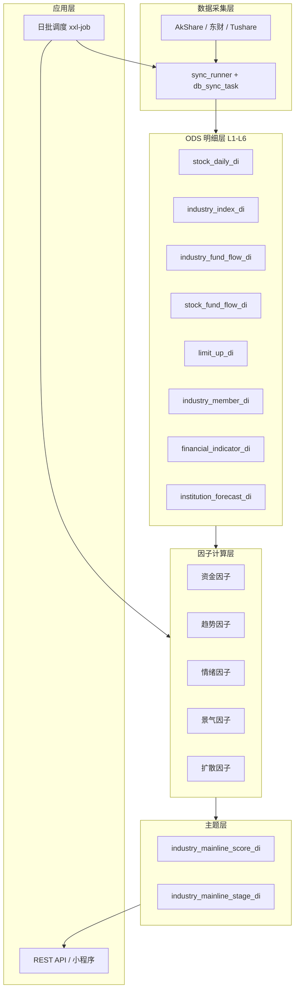

# 需求1：主线板块确认 — 技术文档

> 来源：`industry_indicator_system.xlsx` → Sheet《需求1—主线板块确认》  
> 版本：v1.0  
> 更新日期：2026-05-22

---

## 1. 系统架构



---

## 2. 数据分层（L1–L7）

| 层级 | 内容 | 说明 |
|------|------|------|
| L1 | 股票基础行情 | 所有计算基础 |
| L2 | 行业板块数据 | 行业指数、成分股 |
| L3 | 资金流数据 | 主线识别最核心 |
| L4 | 情绪数据 | 涨停、涨跌家数等 |
| L5 | 基本面/景气数据 | 业绩、ROE 等 |
| L6 | 机构预期数据 | 盈利预测修正 |
| L7 | 宏观数据 | 可选进阶 |

---

## 3. 核心数据表清单

| 序号 | 表名 | 层级 | 用途 | 优先级 | 当前状态（stock_data） |
|------|------|------|------|--------|------------------------|
| 1 | `stock_daily_di` | L1 | RS、趋势、扩散 | S | 待建设 |
| 2 | `industry_index_di` | L2 | 主升浪、成交占比 | S | 待建设 |
| 3 | `industry_fund_flow_di` | L3 | 增量资金、主力动向 | S | 历史有方案，需恢复同步 |
| 4 | `stock_fund_flow_di` | L3 | 龙头、补涨、扩散 | A | **已同步（即时）** |
| 5 | `limit_up_di` | L4 | 赚钱效应、情绪 | A | 待建设 |
| 6 | `market_breadth_di` | L4 | 市场风险偏好 | A | 待建设 |
| 7 | `industry_member_di` | L2 | 行业聚合、联动 | S | 待建设 |
| 8 | `financial_indicator_di` | L5 | 景气、业绩 | A | 待建设 |
| 9 | `institution_forecast_di` | L6 | 预期上修 | A | 待建设 |
| 10 | `etf_flow_di` | L3/L6 | 机构加仓方向 | A | 待建设 |
| 11 | `lhb_di` | L3 | 游资 vs 机构 | B | 待建设 |
| 12 | `news_hot_di` | L4 | 热点共识 | B | 待建设 |

**输出表（本需求新增）**

| 表名 | 说明 |
|------|------|
| `industry_mainline_score_di` | 行业五维得分、总分、等级、排名 |
| `industry_mainline_stage_di` | 行业三阶段标签及触发因子快照 |

---

## 4. 核心表字段设计（摘要）

### 4.1 `stock_daily_di`（L1）

| 字段 | 类型 | 说明 |
|------|------|------|
| trade_date | DATE | 交易日 |
| stock_code | VARCHAR(16) | 股票代码 |
| close_price / open_price / high_price / low_price | DECIMAL | 价格 |
| pct_chg | DECIMAL | 涨跌幅 |
| volume / amount | DECIMAL | 量额 |
| turnover / amplitude | DECIMAL | 换手、振幅 |
| market_value | DECIMAL | 总市值 |

分区建议：`trade_date` 或 `datefmt`。

### 4.2 `industry_index_di`（L2）

| 字段 | 说明 |
|------|------|
| industry_code / industry_name | 行业标识 |
| close | 指数收盘 |
| pct_chg | 涨跌幅 |
| amount / turnover | 成交额、换手 |
| pe / pb | 估值 |

### 4.3 `industry_fund_flow_di`（L3）

| 字段 | 说明 |
|------|------|
| industry_code | 行业代码 |
| net_inflow | 主力净流入（万元） |
| super_inflow / large_inflow / medium_inflow / retail_inflow | 分单资金 |
| inflow_ratio | 净流入 / 成交额 |

> 与现有 `industry_fund_flow_di` 宽表设计对齐，实施时统一字段命名。

### 4.4 `limit_up_di`（L4）

| 字段 | 说明 |
|------|------|
| stock_code | 股票 |
| first_limit_time / final_limit_time | 封板时间 |
| limit_reason | 涨停原因（题材） |
| consecutive_limit | 连板数 |
| blast_count | 炸板次数 |

### 4.5 `institution_forecast_di`（L6）

| 字段 | 说明 |
|------|------|
| industry_code | 行业 |
| eps_forecast | EPS 一致预期 |
| profit_forecast | 净利润预期 |
| forecast_change | 预期上调比例 |
| rating | 买入评级占比 |

### 4.6 `industry_mainline_score_di`（输出）

| 字段 | 类型 | 说明 |
|------|------|------|
| trade_date | DATE | 业务日 |
| industry_code | VARCHAR | 行业代码 |
| industry_name | VARCHAR | 行业名称 |
| score_fund | DECIMAL(10,2) | 资金维度 0-100 |
| score_trend | DECIMAL(10,2) | 趋势维度 |
| score_heat | DECIMAL(10,2) | 热度维度 |
| score_prosperity | DECIMAL(10,2) | 景气维度 |
| score_diffusion | DECIMAL(10,2) | 扩散维度 |
| total_score | DECIMAL(10,2) | 加权总分 |
| total_score_ma3/ma5/ma10 | DECIMAL | 滚动均分 |
| mainline_level | VARCHAR(16) | 超级主线/主线/轮动热点/跟风 |
| rank_no | INT | 排名 |
| fund_cont_days | INT | 连续净流入天数 |
| rs_5d | DECIMAL | 5日 RS |
| limit_up_cnt | INT | 涨停数 |
| profit_yoy | DECIMAL | 业绩增速代理 |
| detail_json | JSON | 子因子明细 |
| created_at / updated_at | DATETIME | 审计 |

---

## 5. 因子计算规格

### 5.1 维度与子因子映射

| 类别 | 因子名称 | 计算逻辑 | 来源表 |
|------|----------|----------|--------|
| 资金类 | 连续净流入天数 | 连续 N 日 net_inflow > 0 | industry_fund_flow_di |
| 资金类 | 资金加速度 | 今日净流入 − 近 5 日均值 | industry_fund_flow_di |
| 资金类 | 超大单占比 | super_inflow / net_inflow | industry_fund_flow_di |
| 资金类 | 资金流入强度 | net_inflow / amount | industry_fund_flow_di |
| 趋势类 | 行业 RS | 行业涨幅 − 沪深300涨幅 | industry_index_di + 指数基准 |
| 趋势类 | 均线多头 | MA5 > MA10 > MA20 | industry_index_di |
| 趋势类 | 新高强度 | close = 60d high | industry_index_di |
| 趋势类 | 回撤修复速度 | 跌 3% 后收复天数 | industry_index_di |
| 情绪类 | 涨停扩散率 | 涨停数 / 成分股总数 | limit_up_di + industry_member_di |
| 情绪类 | 连板高度 | 行业内最高连板 | limit_up_di |
| 情绪类 | 成交额占比 | 行业 amount / 全市场 | industry_index_di |
| 景气类 | 利润增速 | 行业净利润同比 | financial_indicator_di |
| 景气类 | 预期修正 | 近 1 月盈利预测上调幅度 | institution_forecast_di |
| 扩散类 | 上涨家数占比 | 上涨家数 / 成分总数 | stock_daily_di + industry_member_di |
| 扩散类 | 20cm 扩散 | 创业板/科创板 20% 涨停数 | limit_up_di + stock_daily_di |

### 5.2 标准化（建议实现）

对每个交易日、每个子因子在全行业截面做：

```
score = 100 * PERCENT_RANK(value)   -- 或 Z-Score 截断到 [0,100]
```

维度得分 = 该维度下子因子得分的**加权平均**（权重可在配置表维护）。

### 5.3 总分合成

```python
total = (
    score_fund * 0.35
    + score_trend * 0.25
    + score_heat * 0.15
    + score_prosperity * 0.15
    + score_diffusion * 0.10
)
```

滚动均分：

```sql
total_score_ma5 = AVG(total_score) OVER (
  PARTITION BY industry_code ORDER BY trade_date
  ROWS BETWEEN 4 PRECEDING AND CURRENT ROW
)
```

### 5.4 等级映射

```python
def level(score: float) -> str:
    if score > 85: return "超级主线"
    if score >= 70: return "主线"
    if score >= 60: return "轮动热点"
    return "跟风"
```

### 5.5 三阶段判定（规则引擎示例）

| 阶段 | 条件（可配置） |
|------|----------------|
| 资金试探 | 资金加速度 > 阈值 且 龙头创 20 日新高 |
| 板块爆发 | 涨停扩散率 > P80 且 RS_5d > 0 连续 3 日 |
| 机构化 | ETF 净流入 5 日为正 且 大市值龙头领涨 |

未满足更高阶段时取当前最高满足阶段；均不满足为 `观察`。

---

## 6. 批处理流程


建议调度顺序（交易日 T 日收盘后）：

| 时间 | 任务 |
|------|------|
| 18:00 | 行业/个股资金流、行业指数 |
| 18:30 | 涨停、市场广度 |
| 19:00 | 因子计算 + 评分 |
| 19:30 | API 缓存刷新 |

与现有 `stock_fund_flow` 19:00 任务衔接，评分任务建议 **19:30** 启动。

---

## 7. 模块划分（建议代码结构）

```
stock_data/
├── sync/                          # 已有：配置化采集
├── etl/
│   ├── factor/                    # 子因子计算
│   │   └── mainline_factors.py
│   └── score/                     # 评分与等级
│       └── mainline_score.py
├── mysql_tables/
│   ├── schema.sql                 # 扩展 ODS + 输出表
│   └── data_config.sql            # 新增 script_key
├── api/                           # 可选 FastAPI
│   └── mainline_rank.py
└── 需求整理/
    ├── 需求1-主线板块确认-需求文档.md
    └── 需求1-主线板块确认-技术文档.md
```

`db_sync_task` 新增示例：

| task_code | script_key | target_table |
|-----------|------------|--------------|
| mainline_score | mainline_score | industry_mainline_score_di |

---

## 8. API 设计（草案）

### GET `/api/v1/mainline/rank`

| 参数 | 类型 | 说明 |
|------|------|------|
| trade_date | string | YYYYMMDD，默认最新交易日 |
| level | string | 过滤等级，逗号分隔 |
| top | int | 默认 20 |
| ma_window | int | 3/5/10，默认 5 |

响应示例：

```json
{
  "trade_date": "2026-05-19",
  "items": [
    {
      "rank": 1,
      "industry_name": "创新药",
      "total_score": 91.0,
      "total_score_ma5": 88.5,
      "mainline_level": "超级主线",
      "stage": "板块爆发",
      "fund_cont_days": 6,
      "rs_5d": 0.082,
      "limit_up_cnt": 4
    }
  ]
}
```

---

## 9. 实施路线图

### Phase 1 — MVP（4~6 周）

- [ ] `industry_fund_flow_di`、`industry_index_di`、`industry_member_di` 日同步
- [ ] 资金+趋势两维因子与总分
- [ ] `industry_mainline_score_di` 落库 + 简单榜单 API

### Phase 2 — 完整五维（+4 周）

- [ ] `limit_up_di`、`stock_daily_di`、`financial_indicator_di`
- [ ] 五维齐全 + 三阶段标签
- [ ] 3/5/10 日均分

### Phase 3 — 产品化（+2 周）

- [ ] 小程序主线 Tab
- [ ] 历史回溯与告警（新晋超级主线）

---

## 10. 风险与技术难点

| 风险 | 缓解 |
|------|------|
| 行业分类不一致 | 固定 `industry_member_di` 版本日 |
| 免费数据源不稳定 | sync 日志告警 + 备用源 |
| 标准化方法争议 | 配置化权重/分位数，支持 A/B |
| 涨停与行业映射延迟 | T+0 用题材字段兜底 |

---

## 11. 参考：评分输出样例

| 排名 | 行业 | 资金(35%) | 趋势(25%) | 情绪(15%) | 景气(15%) | 扩散(10%) | 总分 | 等级 |
|------|------|-----------|-----------|-----------|-----------|-----------|------|------|
| 1 | 创新药 | 92 | 88 | 85 | 90 | 87 | 89 | 超级主线 |
| 2 | CPO | 90 | 91 | 82 | 86 | 85 | 88.1 | 主线 |
| 3 | 电力设备 | 75 | 70 | 60 | 80 | 65 | 72 | 轮动热点 |
| 4 | 银行 | 40 | 35 | 20 | 50 | 30 | 36.5 | 跟风 |

---

## 12. 文档修订记录

| 版本 | 日期 | 说明 |
|------|------|------|
| v1.0 | 2026-05-22 | 由 Excel《需求1—主线板块确认》初稿整理 |
