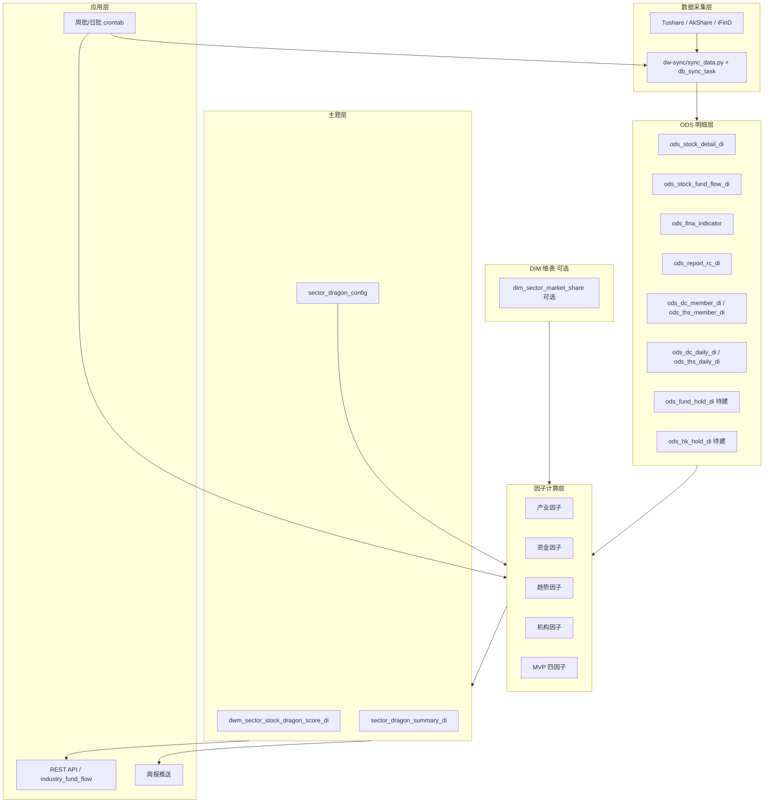
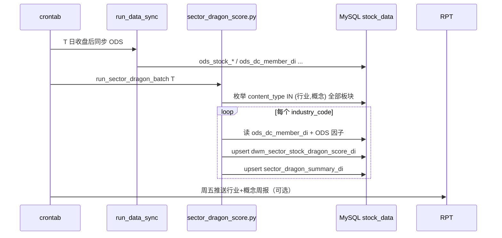

# 需求2：板块龙头股 — 技术文档

> 来源：AI 行业分析平台业务需求  
> 版本：v1.4  
> 更新日期：2026-06-10

---

## 1. 系统架构



与需求1 **共用 ODS**；**行业 + 概念**各板块成分取自 `ods_dc_member_di`（`ts_code`=板块 `industry_code`），按交易日对每个板块独立截面评分，不维护单赛道维表。

---

## 2. 数据分层

| 层级 | 内容 | 本需求用途 |
|------|------|------------|
| L1 | 个股行情 | 涨幅、成交额、市值、创新高 |
| L2 | 板块指数/成分 | RS 分母、成分股自动候选 |
| L3 | 个股/北向/ETF 资金 | 资金龙头 |
| L5 | 财报 | 产业龙头 |
| L6 | 研报、基金持仓 | 机构龙头 |
| DIM | 市占率（可选） | 产业子因子 |

---

## 3. 核心数据表清单

### 3.1 复用 ODS（与需求1 一致）

| 逻辑表名 | 实际 ODS 表 | 本需求用途 | 状态 |
|----------|-------------|------------|------|
| `stock_daily_di` | `ods_stock_detail_di` | 涨跌幅、成交额、量 | **已配置** |
| `stock_fund_flow_di` | `ods_stock_fund_flow_di` | `net_mf_amount` 主力净流入 | **已配置** |
| `financial_indicator_di` | `ods_fina_indicator` | 营收、净利、研发费用 | **已配置** |
| `institution_forecast_di` | `ods_report_rc_di` | 研报数、预期增速 | **已配置** |
| 东财板块指数/元数据 | `ods_dc_index_di` / `dwm_dc_industry_fund_flow_di` | **行业+概念板块枚举**（`content_type`） | **已配置** |
| 东财板块成分 | `ods_dc_member_di` | **成分股范围**（`ts_code`=板块代码，`con_code`=个股） | **已配置** |
| 同花顺板块成分 | `ods_ths_member_di` | 备用成分 + 股票名称 | **已配置** |
| 东财板块日线 | `ods_dc_daily_di` | 板块 N 日涨幅 | **已配置** |
| 同花顺板块日线 | `ods_ths_daily_di` | 板块 N 日涨幅 | **已配置** |
| ETF 份额 | `ods_etf_share_size_di` | ETF 增持子因子（完整版） | **已配置** |

> 完整 ODS 清单见《需求1-主线板块确认-技术文档》§3.2。

### 3.2 本需求新增表

| 表名 | 说明 | 状态 |
|------|------|------|
| `dim_sector_market_share` | 人工市占率（完整版产业子因子） | 可选 |
| `sector_dragon_config` | 权重、窗口、score_mode | 待建设 |
| `dwm_sector_stock_factor_raw_di` | 子因子原始值（可选中间表） | 待建设 |
| `dwm_sector_stock_dragon_score_di` | 四维分 + 综合分 + 排名 | 待建设 |
| `sector_dragon_summary_di` | 五类龙头名称与结论文案 | 待建设 |
| `ods_fund_hold_di` | 基金持股季报 | 待建设 |
| `ods_hk_hold_di` | 北向持股 | 待建设 |

---

## 4. 核心表字段设计

### 4.1 板块枚举与成分股（行业 + 概念）

**板块列表**（每个交易日 `T`）：

```sql
SELECT DISTINCT f.industry_code, f.industry_name, f.content_type
FROM dwm_dc_industry_fund_flow_di f
WHERE f.trade_date = :trade_date
  AND f.content_type IN ('行业', '概念')   -- 可扩展：'地域'
ORDER BY f.content_type, f.industry_name;
```

亦可从 `ods_dc_index_di` + `ods_industry_fund_flow_di` 取当日有行情的板块；与资金强度 DWM 对齐时优先 `dwm_dc_industry_fund_flow_di`。

**成分股**（单板块）：

```sql
SELECT m.con_code AS ts_code, m.name AS stock_name
FROM ods_dc_member_di m
WHERE m.trade_date = :trade_date
  AND m.ts_code = :industry_code;
```

| 规则 | 说明 |
|------|------|
| 默认 `content_type` | `行业` + `概念`（东财全量，合计约 500~800 板块） |
| 最小成分数 | &lt; 3 只则跳过该板块并记 `skip_reason` |
| 批处理 | ETL 对板块列表 **for-loop**，不得硬编码单一 `industry_code` 或单一类型 |

### 4.2 `sector_dragon_config`（参数配置）

| 字段 | 说明 |
|------|------|
| config_key | `__global__` 全局默认；或具体 `industry_code` 覆盖权重 |
| score_mode | `mvp` / `full` |
| content_types | VARCHAR(64) | 批处理纳入的板块类型，默认 `行业,概念`（可含 `地域`） |
| w_industry / w_fund / w_trend / w_inst | 综合分权重，默认 0.2 / 0.35 / 0.25 / 0.2 |
| fund_window_days | 资金因子窗口，默认 20 |
| trend_windows | JSON：`{"d5":30,"d20":40,"new_high":20,"rs":10}` |
| mvp_weights | JSON：`{"fund":0.4,"rs":0.3,"amount_share":0.2,"mv":0.1}` |
| rs_cap | RS 上限，默认 3.0 |
| rs_cap_score | 映射满分，默认 90 |
| effective_date | 生效日 |
| is_active | 是否当前版本 |

### 4.3 `dwm_sector_stock_dragon_score_di`（评分输出）

| 字段 | 类型 | 说明 |
|------|------|------|
| trade_date | DATE | 业务日（资金/趋势） |
| industry_code | VARCHAR(32) | 板块代码 |
| industry_name | VARCHAR(128) | 板块名称 |
| content_type | VARCHAR(16) | 板块类型：`行业` / `概念` / `地域` |
| ts_code | VARCHAR(16) | 股票 |
| stock_name | VARCHAR(64) | 简称 |
| score_industry | DECIMAL(10,2) | 产业分 0–100 |
| score_fund | DECIMAL(10,2) | 资金分 |
| score_trend | DECIMAL(10,2) | 趋势分 |
| score_inst | DECIMAL(10,2) | 机构分 |
| score_composite | DECIMAL(10,2) | 综合分 |
| rank_industry / rank_fund / rank_trend / rank_inst / rank_composite | INT | 板块内排名 |
| is_industry_leader | TINYINT | 产业龙头标记 |
| is_fund_leader | TINYINT | 资金龙头 |
| is_trend_leader | TINYINT | 趋势龙头 |
| is_inst_leader | TINYINT | 机构龙头 |
| is_composite_leader | TINYINT | 综合龙头 |
| score_mode | VARCHAR(8) | mvp / full |
| industry_as_of | DATE | 财报截止日 |
| inst_as_of | DATE | 机构数据截止日 |
| detail_json | JSON | 子因子原始值与排名分 |
| created_at / updated_at | DATETIME | 审计 |

唯一键：`(trade_date, industry_code, ts_code, score_mode)`。

### 4.4 `sector_dragon_summary_di`（文字结论）

| 字段 | 说明 |
|------|------|
| trade_date | 业务日 |
| industry_code / industry_name | 板块 |
| content_type | 板块类型（行业/概念） |
| leader_industry_ts / leader_industry_name | 产业龙头 |
| leader_fund_ts / leader_fund_name | 资金龙头 |
| leader_trend_ts / leader_trend_name | 趋势龙头 |
| leader_inst_ts / leader_inst_name | 机构龙头 |
| leader_composite_ts / leader_composite_name | 综合龙头 |
| summary_text | 渲染后的结论文案 |
| score_mode | mvp / full |

---

## 5. 因子计算规格

### 5.1 排名分标准化（板块内截面）

对每个 `trade_date`、`industry_code`、子因子原始值 `x`：

```python
def percentile_score(values: list[float], x: float) -> float:
    """成分股截面百分位排名 → 0~100"""
    if x is None or math.isnan(x):
        return None
    rank = sum(1 for v in values if v is not None and v <= x)
    n = sum(1 for v in values if v is not None)
    return 100.0 * rank / n if n else None
```

维度分 = 该维度子因子排名分的**加权平均**（缺失子因子权重按比例重分配）。

### 5.2 MVP 四因子（Phase 1）

**成分股集合** `U` = 当日 `ods_dc_member_di` 中 `ts_code = :industry_code` 的全部 `con_code`（见 §4.1）。

| 因子 | 原始值 | 来源 SQL 要点 |
|------|--------|----------------|
| 资金流 | `SUM(net_mf_amount)` 近 20 交易日 | `ods_stock_fund_flow_di`，单位万元 |
| RS | `stock_ret_60d / board_ret_60d` | 个股 `ods_stock_detail_di`；板块 `ods_dc_daily_di` 或 `ods_ths_daily_di` |
| 成交额占比 | `AVG(amount)` 个股 / `SUM(amount)` 板块成分 | `ods_stock_detail_di.amount` 千元 |
| 市值 | 最近 `close * total_share` 或 `daily_basic` 总市值 | MVP 可用成交额×换手代理或接入 `daily_basic` |

**RS 映射分**（业务规则）：

```python
def rs_to_score(rs: float, cap: float = 3.0, cap_score: float = 90.0) -> float:
    if board_ret_60d == 0:
        return None  # 单独处理
    rs_clamped = min(max(rs, 0), cap)
    return cap_score * (rs_clamped / cap)
```

**MVP 综合分**：

```python
composite_mvp = (
    0.4 * score_fund_flow
    + 0.3 * score_rs
    + 0.2 * score_amount_share
    + 0.1 * score_market_cap
)
```

### 5.3 完整版四维因子（Phase 2）

#### 产业分

| 子因子 | 原始值 | 来源 |
|--------|--------|------|
| 市占率 | `dim_sector_market_share.share_pct` 或营收占比代理 | 人工表 / 财报 |
| 营收 | `ods_fina_indicator.revenue` 或 `total_revenue` | 最新 `ann_date <= trade_date` |
| 净利润 | `netprofit` / `n_income_attr_p` | 同上 |
| 研发 | `rd_exp` 或研发费用率 | 同上 |

#### 资金分

| 子因子 | 原始值 | 来源 |
|--------|--------|------|
| 主力净流入 | 近 N 日 `net_mf_amount` 累计 | `ods_stock_fund_flow_di` |
| 机构增仓 | 季报持股变动 | `ods_fund_hold_di` 待建 |
| 北向 | 持股变动或净流入 | `ods_hk_hold_di` 待建 |
| ETF | 映射 ETF 份额 5 日变化 | `ods_etf_share_size_di` + 个股–ETF 映射 |

#### 趋势分

| 子因子 | 原始值 | 来源 |
|--------|--------|------|
| 5 日涨幅 | 收盘价复合收益 | `ods_stock_detail_di` |
| 20 日涨幅 | 同上 | 同上 |
| 创新高次数 | 60 日内 `close = rolling_max(close,20)` 次数 | 窗口计算 |
| RS | 个股 N 日涨幅 / 板块 N 日涨幅 | 个股 + 板块日线 |

#### 机构分

| 子因子 | 原始值 | 来源 |
|--------|--------|------|
| 基金持仓市值 | 季报汇总 | `ods_fund_hold_di` |
| 持仓基金数 | 季报 distinct fund | 同上 |
| 研报数 | 近 30 日 count | `ods_report_rc_di` |
| 预期净利增速 | 一致预期 YoY | `ods_report_rc_di` 聚合 |

**完整版综合分**：

```python
composite_full = (
    0.20 * score_industry
    + 0.35 * score_fund
    + 0.25 * score_trend
    + 0.20 * score_inst
)
```

### 5.4 龙头标签生成

```python
def mark_leaders(rows: list[dict], key: str, flag: str) -> None:
    best = max(rows, key=lambda r: r[key] or -1)
    for r in rows:
        r[flag] = 1 if r["ts_code"] == best["ts_code"] else 0

mark_leaders(rows, "score_industry", "is_industry_leader")
mark_leaders(rows, "score_fund", "is_fund_leader")
mark_leaders(rows, "score_trend", "is_trend_leader")
mark_leaders(rows, "score_inst", "is_inst_leader")
mark_leaders(rows, "score_composite", "is_composite_leader")
```

### 5.5 结论文案模板

```python
TEMPLATE = """【{industry_name}龙头识别】截至 {trade_date}

产业龙头：{leader_industry_name}
资金龙头：{leader_fund_name}
趋势龙头：{leader_trend_name}
机构龙头：{leader_inst_name}
综合龙头：{leader_composite_name}"""
```

MVP 模式下，产业/机构龙头可为空或显示「数据待接入」；资金/趋势可用 MVP 因子代理项填充。

---

## 6. ETL 与 SQL 示例

### 6.1 MVP 主力净流入（20 日）

```sql
SELECT
    f.ts_code,
    SUM(f.net_mf_amount) AS fund_net_20d_wan
FROM ods_stock_fund_flow_di f
INNER JOIN ods_dc_member_di m
    ON m.con_code = f.ts_code
   AND m.ts_code = :industry_code
   AND m.trade_date = :trade_date
WHERE f.trade_date BETWEEN :start_date AND :trade_date
GROUP BY f.ts_code;
```

### 6.2 个股 60 日涨幅

```sql
SELECT
    d.ts_code,
    EXP(SUM(LN(1 + d.pct_chg / 100))) - 1 AS ret_60d
FROM ods_stock_detail_di d
INNER JOIN ods_dc_member_di m
    ON m.con_code = d.ts_code
   AND m.ts_code = :industry_code
   AND m.trade_date = :trade_date
WHERE d.trade_date BETWEEN :start_60 AND :trade_date
GROUP BY d.ts_code;
```

### 6.3 板块 60 日涨幅（东财）

```sql
SELECT
    EXP(SUM(LN(1 + pct_change / 100))) - 1 AS board_ret_60d
FROM ods_dc_daily_di
WHERE ts_code = :board_industry_code
  AND trade_date BETWEEN :start_60 AND :trade_date;
```

### 6.4 研报覆盖（近 30 日）

```sql
SELECT
    ts_code,
    COUNT(*) AS report_cnt_30d
FROM ods_report_rc_di
WHERE report_date BETWEEN DATE_SUB(:trade_date, INTERVAL 30 DAY) AND :trade_date
  AND ts_code IN (
      SELECT con_code FROM ods_dc_member_di
      WHERE ts_code = :industry_code AND trade_date = :trade_date
  )
GROUP BY ts_code;
```

---

## 7. 批处理流程与调度



| 任务 | 频率 | 依赖 | 脚本（规划） |
|------|------|------|--------------|
| ODS 日同步 | 每日 | Tushare 就绪 | `run_data_sync` |
| 龙头 MVP 评分 | 每周五 或 每日 | `daily`、`moneyflow`、`dc_member` | `dw-dwm/pro_dwm_sector_dragon_score.sh` |
| 产业/机构刷新 | 季报后 | `fina_indicator`、基金持仓 | 同上，`score_mode=full` |

建议调度顺序：与《需求1》一致，在 `run_data_sync` 与个股/板块 ODS 就绪后执行龙头批处理（**17:30+**）。批处理入口**不传**单一 `industry_code`，由脚本内部枚举行业 + 概念板块。

---

## 8. 模块划分（规划）

```
stock_data/
├── dw-dwm/
│   └── pro_dwm_sector_dragon_score.sh      # 入口：bash 调 Python/SQL（行业+概念批处理）
├── etl/sector_dragon/                      # 待建
│   ├── batch.py                            # 枚举板块 + 并行调度
│   ├── score_mvp.py
│   ├── score_full.py
│   ├── leaders.py
│   └── summary.py
├── mysql_tables/
│   └── stock_data.sql                      # 追加 sector_dragon_* / dwm_sector_* DDL
├── industry_fund_flow/                     # Web 展示
│   └── app/routes_dragon.py                # 待建
└── 需求整理/
    ├── 需求2-板块龙头股-需求文档.md
    └── 需求2-板块龙头股-技术文档.md
```

`func.sh` 封装：

```bash
run_sector_dragon_batch() {
  local dt="${1:-$(get_date)}"
  local content_types="${2:-行业,概念}"
  bash "${DW_ROOT}/dw-dwm/pro_dwm_sector_dragon_score.sh" "${dt}" "${content_types}"
}
```

---

## 9. API 设计（草案）

与需求文档 §4.5 对齐。

### GET `/api/v1/dragon/boards`

| 参数 | 类型 | 说明 |
|------|------|------|
| trade_date | string | YYYYMMDD，默认最新 |
| content_types | string | 逗号分隔，默认 `行业,概念` |

响应：行业 + 概念板块列表 + 当日综合龙头摘要（含 `content_type`、`leader_composite_name`、`score_composite` 等）。

### GET `/api/v1/dragon/boards/{industry_code}/scores`

| 参数 | 类型 | 说明 |
|------|------|------|
| trade_date | string | YYYYMMDD，默认最新 |
| mode | string | `mvp` / `full`，默认配置表 |

响应示例：

```json
{
  "trade_date": "2026-06-06",
  "industry_code": "BK1036.DC",
  "industry_name": "半导体",
  "content_type": "行业",
  "score_mode": "mvp",
  "items": [
    {
      "ts_code": "603986.SH",
      "stock_name": "兆易创新",
      "score_industry": null,
      "score_fund": 98.0,
      "score_trend": 95.0,
      "score_inst": null,
      "score_composite": 94.3,
      "rank_composite": 1,
      "is_composite_leader": 1
    }
  ]
}
```

### GET `/api/v1/dragon/boards/{industry_code}/summary`

```json
{
  "trade_date": "2026-06-06",
  "industry_name": "人工智能",
  "content_type": "概念",
  "leader_composite_name": "…",
  "summary_text": "【人工智能板块龙头识别】截至 2026-06-06\n\n..."
}
```

### GET `/api/v1/dragon/leaders`

| 参数 | 类型 | 说明 |
|------|------|------|
| trade_date | string | 默认最新 |
| content_types | string | 默认 `行业,概念` |
| top | int | 跨板块返回条数，默认 50 |
| sort | string | `composite` / `fund` / `trend`，默认 `composite` |

跨板块龙头速览，供首页榜单使用。

---

## 10. Web 展示（规划）

在 `industry_fund_flow` 增加侧栏入口「板块龙头」：

| 区域 | 内容 |
|------|------|
| 筛选 | `content_type`（默认行业+概念，可多选）、板块下拉、交易日、模式 mvp/full |
| 全市场摘要 | `/dragon/leaders` 或 `/dragon/boards` 表格 |
| 单板块主表 | §4.3 五列评分表，支持按综合分排序 |
| 结论区 | `summary_text` 渲染 |
| 下钻 | 点击个股展开 `detail_json` 子因子 |

样式复用 `dc_fund_flow` 的 `data-table`、`cell-rise` / `cell-fall`。

---

## 11. Excel 模板（规划）

路径建议：`需求整理/templates/板块龙头股评分模板.xlsx`

| Sheet | 内容 |
|-------|------|
| 评分表 | 股票 + 五列分数 + 排名 |
| 参数 | 权重、窗口与 `sector_dragon_config` 对齐 |
| 公式说明 | MVP / 完整版公式与样例行（兆易创新等） |

导出：API `?format=xlsx` 或 ETL 后脚本写文件。

---

## 12. 实施路线图

### Phase 0 — 数据准备（1 周）

- [ ] `sector_dragon_config`、`dwm_sector_stock_dragon_score_di`、`sector_dragon_summary_di` DDL
- [ ] 确认 `dwm_dc_industry_fund_flow_di` 与 `ods_dc_member_di` 板块代码一致
- [ ] 批处理枚举逻辑（`content_type IN ('行业','概念')` 全量）

### Phase 1 — MVP（2 周）

- [ ] `batch.py` + `score_mvp.py`：行业+概念四因子 + 综合分 + 排名
- [ ] 资金/趋势龙头标签；各板块综合龙头结论
- [ ] `run_sector_dragon_batch` + 周调度
- [ ] `/dragon/boards`、`/dragon/leaders`、单板块 scores/summary API

### Phase 2 — 完整四维（4 周）

- [ ] 产业分：财报因子 + 市占率人工表
- [ ] 机构分：研报 + 基金持仓 ODS
- [ ] 资金分：北向、ETF（随 ODS）
- [ ] 五类龙头 + 完整结论文案
- [ ] Web 全市场榜 + 单板块下钻

### Phase 3 — 产品化（2 周）

- [ ] Excel 模板与导出
- [ ] 行业+概念周报推送（邮件/企微）
- [ ] `sector_dragon_config` 管理页（按板块覆盖权重）

---

## 13. 风险与技术难点

| 风险 | 缓解 |
|------|------|
| 东财/同花顺成分不一致 | 默认东财 `ods_dc_member_di`；RS 可用 `ods_dc_daily_di` 对齐 |
| 基金持仓滞后 | 机构分标注 `inst_as_of`；季度更新预期管理 |
| 市占率无免费源 | Phase 2 人工表 `dim_sector_market_share` |
| 小市值干扰 | 市值分权重 + 可配置剔除阈值 |
| MVP 与完整版并存 | `score_mode` 字段隔离；Web 明确标注模式 |
| 行业+概念批处理耗时 | 板块级并行（建议 8~16 worker）；成分 &lt; 3 跳过；概念板块可配置更大最小成分阈值 |

---

## 14. 参考：评分输出样例

| 股票 | 产业分 | 资金分 | 趋势分 | 机构分 | 综合分 |
|------|--------|--------|--------|--------|--------|
| 兆易创新 | 95 | 98 | 95 | 90 | 94.3 |
| 澜起科技 | 90 | 70 | 75 | 85 | 79.8 |
| 北京君正 | 70 | 50 | 60 | 60 | 61.5 |

**结论示例（单板块）**

```
【半导体板块龙头识别】截至 2026-06-06

产业龙头：兆易创新
资金龙头：兆易创新
趋势龙头：兆易创新
机构龙头：澜起科技
综合龙头：兆易创新
```

---

## 15. 文档修订记录

| 版本 | 日期 | 说明 |
|------|------|------|
| v1.0 | 2026-06-10 | 初稿：架构、表设计、MVP/完整版因子、API 与实施路线 |
| v1.1 | 2026-06-10 | `dim_sector_pool` 字段统一为 `industry_code`/`industry_name` |
| v1.2 | 2026-06-10 | 移除 `dim_sector_pool`；成分改由 `ods_dc_member_di` 提供 |
| v1.3 | 2026-06-10 | 取消「仅存储芯片」；全行业批处理、`run_sector_dragon_batch`、API 与需求文档 v1.3 对齐 |
| v1.4 | 2026-06-10 | 默认范围扩展为**行业 + 概念**；落库/API/调度默认值、`content_type` 字段同步 |
