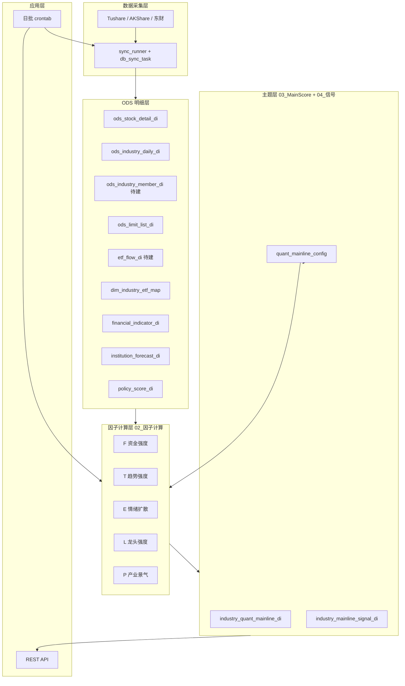
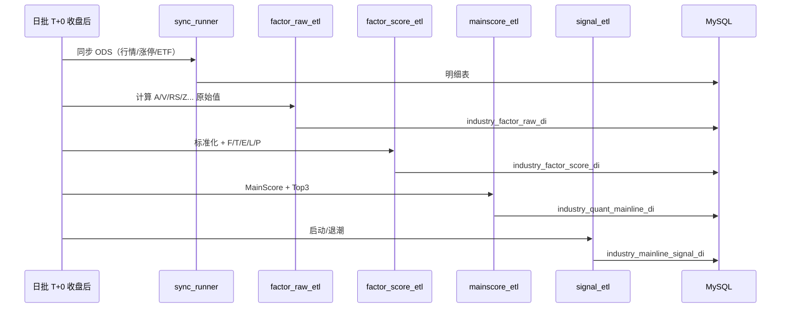

# 需求3：量化主线板块 — 技术文档

> 来源：`industry_indicator_system.xlsx` → Sheet《需求3—量化主线板块》  
> 版本：v1.1  
> 更新日期：2026-05-28

---

## 1. 系统架构



与需求1共用 ODS；本需求独立 **FTELP 因子引擎**、**MainScore**、**启动/退潮信号** 及 **参数配置**。

---

## 2. 数据分层与表清单

### 2.1 复用 ODS（与需求1 一致）

| 逻辑表名 | 实际 ODS / 状态 | 层级 | 本需求用途 | 优先级 |
|----------|-----------------|------|------------|--------|
| `stock_daily_di` | `ods_stock_detail_di`（**已配置** `daily`） | L1 | RS、N、U、龙头涨跌、A 杀 | S |
| `industry_index_di` | `ods_industry_daily_di`（**已同步** `sw_daily`） | L2 | 行业收益、成交额、换手 | S |
| `industry_fund_flow_di` | `ods_industry_fund_flow_di`（**已同步**） | L3 | 辅助资金类校验 | S |
| `industry_member_di` | `ods_index_member_all`（**已配置** `index_member_all`） | L2 | 行业聚合、涨停统计分母 | S |
| `limit_up_di` | `ods_limit_list_di`（**已配置** `limit_list_d`，U/D/Z） | L4 | Z、J、B、LC | S |
| `etf_flow_di` | 待建；源 **`etf_share_size`** + **`dim_industry_etf_map`** | L3 | ETF 子因子 | A |
| `financial_indicator_di` | `ods_fina_indicator`（**已配置** `fina_indicator_vip`） | L5 | Earnings | A |
| `institution_forecast_di` | 待建；源 **`report_rc`** | L6 | Forecast | A |

> 完整接口对照、积分与 ETL 说明见《需求1-主线板块确认-技术文档》**§3.4**。

### 2.1b 数据源接口速查（本需求相关）

| 逻辑表 / 因子 | Tushare `source_table` | 说明 |
|---------------|------------------------|------|
| 成分股 `industry_member_di` | `index_member_all` / `index_member` | 与 `ods_industry_classify` 的 `index_code` 关联 |
| 日线 `stock_daily_di` | `daily` | 已入 `data_config` → `ods_stock_detail_di` |
| 涨跌停 Z/J/B | `limit_list_d` | `limit` 字段 U/D/Z；已入 `data_config` |
| ETF 子因子 | `etf_share_size` + 维表 **`dim_industry_etf_map`**（`dw-dim/pro_dim_industry_etf_map.sh`） | `etf_basic` 辅助 ETF↔指数 |
| Earnings | `fina_indicator_vip` | 行业层按成分聚合 |
| Forecast | `report_rc` | `eps`/`np`/`rating`；上调比例需 ETL diff |
| Policy | — | 首期 `policy_score_di` 人工维护，无标准行情接口 |

### 2.2 本需求新增表

| 表名 | 对应 Excel 层 | 说明 |
|------|---------------|------|
| `dim_industry_etf_map` | DIM | 行业代码 ↔ ETF 代码、权重；**已 ETL**（与需求1共用） |
| `policy_score_di` | P.Policy | 行业政策热度 0–1（人工或 NLP） |
| `industry_leader_di` | L | 每日行业龙头代码（计算中间表，可选） |
| `industry_factor_raw_di` | 01_原始数据 | 子因子原始值（A、V、RS、Z…） |
| `industry_factor_score_di` | 02_因子计算 | F/T/E/L/P 及子因子标准化分 |
| `industry_quant_mainline_di` | 03_MainScore | MainScore、排名、Top3 标记 |
| `industry_mainline_signal_di` | 04_信号判断 | signal_start、signal_exit |
| `quant_mainline_config` | 05_参数配置 | 权重、阈值、版本、生效日 |

---

## 3. 核心表字段设计

### 3.1 `dim_industry_etf_map`（逻辑名 `industry_etf_map`）

| 字段 | 类型 | 说明 |
|------|------|------|
| industry_code | VARCHAR(32) | 行业代码 |
| etf_code | VARCHAR(16) | ETF 代码 |
| weight | DECIMAL(5,4) | 映射权重，默认 1 |
| effective_date | DATE | 生效日 |
| remark | VARCHAR(128) | 如「芯片 ETF→半导体」 |

### 3.2 `industry_factor_raw_di`（01 原始/中间）

| 字段 | 说明 |
|------|------|
| trade_date | 交易日 |
| industry_code | 行业 |
| factor_code | 子因子编码：`A`,`V`,`ETF`,`H`,`RS`,`N`,`R`,`M`,`Z`,`J`,`B`,`U`,`LR`,`LC`,`LP`,`Earnings`,`Policy`,`Forecast` |
| raw_value | DECIMAL | 原始值 |
| extra_json | JSON | 如龙头代码、连板数 |

主键建议：`(trade_date, industry_code, factor_code)`。

### 3.3 `industry_factor_score_di`（02 因子计算）

| 字段 | 说明 |
|------|------|
| trade_date | 交易日 |
| industry_code | 行业 |
| score_f / score_t / score_e / score_l / score_p | 五大主因子 0–100 |
| f_a, f_v, f_etf, f_h | F 子因子标准化分（可选列或 JSON） |
| t_rs, t_n, t_r, t_m | T 子因子 |
| e_z, e_j, e_b, e_u | E 子因子 |
| l_lr, l_lc, l_lp | L 子因子 |
| p_earnings, p_policy, p_forecast | P 子因子 |
| detail_json | JSON | 完整明细 |

### 3.4 `industry_quant_mainline_di`（03 MainScore）

| 字段 | 类型 | 说明 |
|------|------|------|
| trade_date | DATE | 业务日 |
| industry_code | VARCHAR(32) | 行业 |
| industry_name | VARCHAR(64) | 名称 |
| main_score | DECIMAL(10,2) | MainScore |
| main_score_ma3/ma5/ma10 | DECIMAL | 滚动均分 |
| rank_no | INT | 全市场排名 |
| is_top3 | TINYINT | 是否 Top3 |
| score_f … score_p | DECIMAL | 五主因子（冗余便于查询） |
| config_version | VARCHAR(16) | 使用的参数版本 |
| detail_json | JSON | 子因子快照 |
| created_at / updated_at | DATETIME | 审计 |

### 3.5 `industry_mainline_signal_di`（04 信号）

| 字段 | 类型 | 说明 |
|------|------|------|
| trade_date | DATE | 业务日 |
| industry_code | VARCHAR | 行业 |
| signal_start | TINYINT | 主线启动 0/1 |
| signal_exit | TINYINT | 主线退潮 0/1 |
| signal_reason | JSON | 各条件真值快照，便于审计 |
| leader_code | VARCHAR(16) | 当日龙头 |
| leader_pct_chg | DECIMAL | 龙头涨跌幅（A 杀判断） |
| config_version | VARCHAR(16) | 参数版本 |

### 3.6 `quant_mainline_config`（05 参数配置）

| 字段 | 说明 |
|------|------|
| config_version | 版本号，如 `v1.0` |
| effective_date | 生效日 |
| w_f, w_t, w_e, w_l, w_p | MainScore 权重 |
| f_w_a, f_w_v, f_w_etf, f_w_h | F 内部权重（默认 0.4/0.3/0.2/0.1） |
| t_w_rs, t_w_n, t_w_r, t_w_m | T 内部权重 |
| e_w_z, e_w_j, e_w_b, e_w_u | E 内部权重 |
| l_w_lr, l_w_lc, l_w_lp | L 内部权重 |
| p_w_earnings, p_w_policy, p_w_forecast | P 内部权重 |
| th_rs_start | 启动 RS 阈值，默认 1.2 |
| th_rs_exit | 退潮 RS 阈值，默认 0.9 |
| th_a_up_days | A 连续上升天数，默认 3 |
| th_a_down_days | A 连续下降天数，默认 2 |
| th_z_mult | Z 相对全市场倍数，默认 1.5 |
| th_r_max_days | 回撤修复天数上限，默认 3 |
| th_leader_drop | A 杀跌幅阈值，默认 -0.07 |
| th_blast_rate | 炸板率阈值，默认 0.40 |
| is_active | 是否当前生效 |

---

## 4. 因子计算规格

### 4.1 子因子 SQL/逻辑摘要

| 子因子 | 计算逻辑 | 主要依赖（ODS） |
|--------|----------|-----------------|
| A | `industry_amount / market_amount` | `ods_industry_daily_di` |
| V | `MA5(amount) / MA20(amount)` | `ods_industry_daily_di` |
| ETF | `SUM(etf_net_inflow_5d) / SUM(etf_total_size)` 按 map 聚合 | `etf_flow_di`（源 `etf_share_size`）+ **`dim_industry_etf_map`** |
| H | `AVG(industry_turnover) / AVG(market_turnover)` | `ods_industry_daily_di`, `ods_stock_detail_di` |
| RS | `ret_industry_20d / ret_benchmark_20d` | `ods_industry_daily_di` + 沪深300 |
| N | `COUNT(new_high_1y) / COUNT(members)` | `ods_stock_detail_di` + `ods_industry_member_di` |
| R | `drawdown_days / recovery_days` → 标准化取反 | `ods_industry_daily_di` |
| M | `SLOPE(MA30, 30)` | `ods_industry_daily_di` |
| Z | `limit_up_cnt / member_cnt` | `ods_limit_list_di`（`limit='U'`）+ `ods_industry_member_di` |
| J | `continue_limit / yesterday_limit` | `ods_limit_list_di` |
| B | `1 - blast_cnt / touch_limit_cnt` | `ods_limit_list_di`（`Z` / `open_times`） |
| U | `up_cnt / member_cnt` | `ods_stock_detail_di` |
| LR | `leader_ret_20d - benchmark_ret_20d` | `industry_leader_di` |
| LC | `MAX(consecutive_limit)` in industry | `ods_limit_list_di` |
| LP | 历史统计龙头次日收益 | 二期回测表 |
| Earnings | 行业净利润同比增速或一致预期 | financial_indicator_di |
| Policy | policy_score_di.score | policy_score_di |
| Forecast | 上调比例或研报环比 | institution_forecast_di |

### 4.2 主因子合成（Python 伪代码）

```python
def composite_factor(sub_scores: dict[str, float], weights: dict[str, float]) -> float:
    """sub_scores: 已标准化 0-100"""
    total_w = sum(weights[k] for k in weights if sub_scores.get(k) is not None)
    if total_w == 0:
        return None
    return sum(sub_scores[k] * weights[k] for k in weights if sub_scores.get(k) is not None) / total_w

# F = 0.4*A + 0.3*V + 0.2*ETF + 0.1*H
score_f = composite_factor({"A": s_a, "V": s_v, "ETF": s_etf, "H": s_h}, cfg.f_weights)
# T, E, L, P 同理
```

### 4.3 截面标准化

```python
def percentile_score(series: pd.Series) -> pd.Series:
    return series.rank(pct=True) * 100
```

对每个 `trade_date`、每个 `factor_code` 在全行业截面上做 `percentile_score`。

### 4.4 MainScore

```python
main_score = (
    cfg.w_f * score_f
    + cfg.w_t * score_t
    + cfg.w_e * score_e
    + cfg.w_l * score_l
    + cfg.w_p * score_p
)
```

默认权重示例（需在 `quant_mainline_config` 落库，勿写死）：

```text
w_f=0.30, w_t=0.30, w_e=0.15, w_l=0.15, w_p=0.10
```

### 4.5 Top3

```sql
UPDATE industry_quant_mainline_di t
JOIN (
  SELECT industry_code,
         ROW_NUMBER() OVER (ORDER BY main_score DESC) AS rk
  FROM industry_quant_mainline_di
  WHERE trade_date = :d
) x ON t.industry_code = x.industry_code AND t.trade_date = :d
SET t.rank_no = x.rk,
    t.is_top3 = IF(x.rk <= 3, 1, 0);
```

### 4.6 信号引擎（04_信号判断）

```python
def eval_start(row, mkt, cfg) -> tuple[bool, dict]:
    cond = {
        "rs_gt": row.rs > cfg.th_rs_start,
        "a_up_3d": row.a_slope_3d > 0,  # 连续3日上升
        "z_gt": row.z > cfg.th_z_mult * mkt.z_mean,
        "leader_new_high": row.leader_new_high,
        "r_le": row.r_days <= cfg.th_r_max_days,
    }
    return all(cond.values()), cond

def eval_exit(row, cfg) -> tuple[bool, dict]:
    cond = {
        "rs_lt": row.rs < cfg.th_rs_exit,
        "a_down_2d": row.a_slope_2d < 0,
        "leader_ash": row.leader_pct_chg <= cfg.th_leader_drop,
        "blast_gt": row.blast_rate > cfg.th_blast_rate,
    }
    return all(cond.values()), cond
```

写入 `industry_mainline_signal_di.signal_reason` 为 JSON。

---

## 5. 批处理流程



建议调度（交易日）：

| 时间 | 任务 |
|------|------|
| 18:00 | 行业指数、个股日线、涨停 |
| 18:30 | ETF 资金流、龙头表 |
| 19:00 | 因子原始值 + 标准化 + 主因子 |
| 19:20 | MainScore + Top3 |
| 19:30 | 信号判断 + API 缓存 |

与 `stock_fund_flow` 19:00 任务衔接，量化主线任务建议 **19:20** 起。

---

## 6. 模块划分（代码结构）

```
stock_data/
├── etl/
│   ├── factor/
│   │   ├── quant_mainline_raw.py      # 01 子因子原始值
│   │   └── quant_mainline_ftelp.py    # 02 F/T/E/L/P
│   ├── score/
│   │   └── quant_mainline_score.py    # 03 MainScore + Top3
│   └── signal/
│       └── quant_mainline_signal.py   # 04 启动/退潮
├── mysql_tables/
│   ├── quant_mainline_schema.sql
│   └── data_config.sql                # script_key 扩展
├── api/
│   └── quant_mainline.py
└── 需求整理/
    ├── 需求3-量化主线板块-需求文档.md
    └── 需求3-量化主线板块-技术文档.md
```

`db_sync_task` 新增示例：

| task_code | script_key | target_table |
|-----------|------------|--------------|
| quant_mainline_score | quant_mainline_score | industry_quant_mainline_di |
| quant_mainline_signal | quant_mainline_signal | industry_mainline_signal_di |

---

## 7. API 设计（草案）

### GET `/api/v1/quant-mainline/top`

| 参数 | 说明 |
|------|------|
| trade_date | YYYYMMDD，默认最新 |
| top | 默认 3 |
| ma_window | 3/5/10，默认 5 |

响应示例：

```json
{
  "trade_date": "2026-05-27",
  "config_version": "v1.0",
  "items": [
    {
      "rank": 1,
      "industry_name": "半导体",
      "main_score": 87.2,
      "main_score_ma5": 84.1,
      "scores": { "F": 90, "T": 88, "E": 85, "L": 82, "P": 78 },
      "signal_start": true,
      "signal_exit": false
    }
  ]
}
```

### GET `/api/v1/quant-mainline/{industry_code}/radar`

返回五维分值，供前端雷达图。

### GET `/api/v1/quant-mainline/config`

返回当前生效 `quant_mainline_config`。

---

## 8. 实施路线图

### Phase 1 — MVP（4 周）

- [x] `ods_industry_daily_di`、`ods_stock_detail_di`、`ods_limit_list_di`（同步任务已配置，需跑通校验）
- [x] `ods_index_member_all`（`index_member_all`）
- [x] `ods_fina_indicator`（`fina_indicator_vip`）
- [ ] A、V、RS、Z、U 子因子 + F、T、E 主因子（L/P 暂置中性分或省略降权）
- [ ] `industry_quant_mainline_di` + Top3 API

### Phase 2 — 完整 FTELP（+4 周）

- [ ] ETF 映射 + `etf_flow_di`；L 龙头规则 + LC/LR
- [ ] P：Earnings、Forecast；Policy 人工表
- [ ] `industry_mainline_signal_di` 启动/退潮
- [ ] `quant_mainline_config` 热加载

### Phase 3 — 产品化（+2 周）

- [ ] 雷达图 API、历史曲线
- [ ] 与需求1 榜单对照页；参数 A/B 回测脚本

---

## 9. 风险与技术难点

| 风险 | 缓解 |
|------|------|
| 炸板率 B 与退潮条件口径不一致 | 信号层统一用「原始炸板率」，文档与配置分离 |
| ETF 映射不全 | 无映射行业 ETF 子因子降权，不填 0 |
| 龙头识别争议 | 可配置规则 + 对接需求2 龙头表 |
| LP 需长历史 | 二期默认 LP=50 中性或仅用 LR+LC |
| Policy 难自动化 | 首期 `policy_score_di` 人工维护 |

---

## 10. 配置表示例（05_参数配置）

```sql
INSERT INTO quant_mainline_config (
  config_version, effective_date, is_active,
  w_f, w_t, w_e, w_l, w_p,
  th_rs_start, th_rs_exit, th_a_up_days, th_a_down_days,
  th_z_mult, th_r_max_days, th_leader_drop, th_blast_rate
) VALUES (
  'v1.0', '2026-05-28', 1,
  0.30, 0.30, 0.15, 0.15, 0.10,
  1.2, 0.9, 3, 2,
  1.5, 3, -0.07, 0.40
);
```

---

## 11. 文档修订记录

| 版本 | 日期 | 说明 |
|------|------|------|
| v1.0 | 2026-05-28 | 由 Excel《需求3—量化主线板块》初稿整理 |
| v1.1 | 2026-05-28 | 对齐需求1 v1.2：ODS 实际表名、已配置同步任务、§2.1b 接口速查；Phase 1 勾选进度 |
