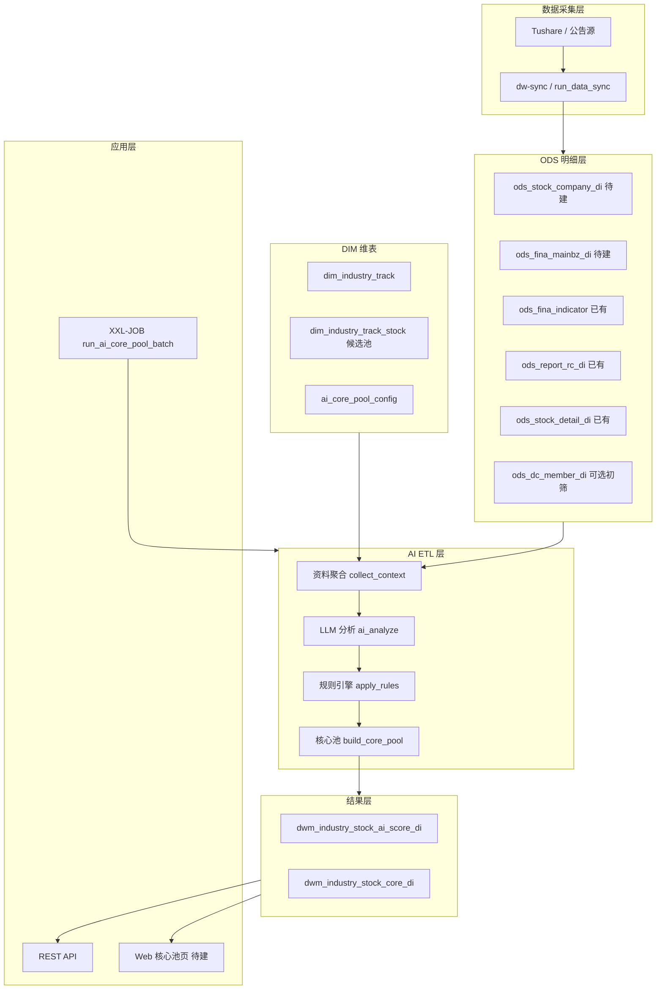

# 需求4：AI 板块成分股识别 — 技术文档

> 版本：v1.0  
> 更新日期：2026-06-16  
> 关联：《需求4-AI板块成分股识别-需求文档》

---

## 1. 系统架构



**与需求2 的差异**：需求2 对东财**全板块**做规则因子评分；本需求对 **东财热度 TopN 赛道**（`dim_industry_track`）调用 **LLM** 做语义归属；候选股来自 **东财板块成分**（`dim_industry_track_stock` ← `ods_dc_member_di`），不以东财成分为最终核心池，仅作 AI 分析输入范围。

---

## 2. 数据分层

| 层级 | 内容 | 本需求用途 |
|------|------|------------|
| DIM | 赛道定义、候选股、AI 配置 | 分析范围与 Prompt 版本 |
| ODS | 公司资料、财报分部、研报 | LLM 输入上下文 |
| DWM | AI 评分、核心池 | 对外查询与组合权重 |
| APP | API / Web | 展示与人工复核 |

---

## 3. 核心表设计

### 3.1 DIM：`dim_industry_track`（东财热度 TopN 赛道）

**数据来源**：`dwm_dc_industry_market_heat_di`（东财板块市场热度 DWM，基于 `ods_dc_daily` / `ods_dc_member` / `ods_dc_hot` 聚合）。

**筛选规则**（默认 Top **50**，`AI_CORE_TRACK_TOP_N` 可配）：

| 步骤 | 说明 |
|------|------|
| 范围 | `content_type IN ('概念','行业')`（`AI_CORE_TRACK_CONTENT_TYPES` 可配） |
| 主排序 | `amount_ratio` 降序（板块成交额占全 A 比，东财热度核心指标） |
| 次排序 | `dc_hot_rank` 升序（成分股东财 App **人气榜**最佳排名，越小越热） |
| 再次 | `pct_change` 降序 |
| 过滤 | `constituent_cnt >= 3`（`AI_CORE_TRACK_MIN_CONST`） |

**刷新**：`run_dim_industry_track YYYYMMDD`（`dw-dim/pro_dim_industry_track.sh`），前置 `run_dwm_dc_industry_market_heat`。

```sql
CREATE TABLE IF NOT EXISTS dim_industry_track (
    industry_id       VARCHAR(32)  NOT NULL COMMENT '赛道ID=东财板块代码 BKxxxx.DC',
    industry_name     VARCHAR(128) NOT NULL COMMENT '赛道名称',
    as_of_date        DATE         NOT NULL COMMENT '快照交易日',
    content_type      VARCHAR(16)  NULL COMMENT '概念/行业/地域',
    dc_board_code     VARCHAR(32)  NOT NULL COMMENT '东财板块代码',
    heat_rank         INT          NULL COMMENT '同类型内成交额占比排名',
    heat_sort         INT          NOT NULL COMMENT '入选赛道总排序1..N',
    amount_ratio      DECIMAL(20, 8) NULL COMMENT '成交额占全A比',
    dc_hot_rank       INT          NULL COMMENT '成分股东财人气榜最佳排名',
    dc_hot_rank_soar  INT          NULL COMMENT '成分股东财飙升榜最佳排名',
    pct_change        DECIMAL(20, 6) NULL COMMENT '板块涨跌幅(%)',
    status            TINYINT      NOT NULL DEFAULT 1 COMMENT '1启用 0历史批次',
    source            VARCHAR(32)  NOT NULL DEFAULT 'dc_market_heat',
    remark            VARCHAR(512) NULL,
    created_at        DATETIME     NOT NULL DEFAULT CURRENT_TIMESTAMP,
    updated_at        DATETIME     NOT NULL DEFAULT CURRENT_TIMESTAMP ON UPDATE CURRENT_TIMESTAMP,
    PRIMARY KEY (industry_id, as_of_date),
    KEY idx_track_asof_sort (as_of_date, status, heat_sort)
) ENGINE=InnoDB DEFAULT CHARSET=utf8mb4 COMMENT='AI核心池-东财热度赛道维表';
```

> `source='manual'` 行由运营人工维护，日批**不覆盖**，仅将历史 `dc_market_heat` 批次 `status=0`。

### 3.2 DIM：`dim_industry_track_stock`（东财板块成分）

**数据来源**：`ods_dc_member_di`，按 `dim_industry_track.dc_board_code` + `as_of_date` 关联，取当日东财板块**全量成分股**。

```sql
CREATE TABLE IF NOT EXISTS dim_industry_track_stock (
    id            BIGINT PRIMARY KEY AUTO_INCREMENT,
    industry_id   VARCHAR(32)  NOT NULL COMMENT '关联 dim_industry_track.industry_id',
    as_of_date    DATE         NOT NULL COMMENT '快照交易日',
    ts_code       VARCHAR(16)  NOT NULL COMMENT '成分股TS代码',
    stock_name    VARCHAR(64)  NULL,
    source        VARCHAR(32)  NOT NULL DEFAULT 'dc_member' COMMENT 'dc_member|manual',
    is_active     TINYINT      NOT NULL DEFAULT 1,
    created_at    DATETIME     NOT NULL DEFAULT CURRENT_TIMESTAMP,
    updated_at    DATETIME     NOT NULL DEFAULT CURRENT_TIMESTAMP ON UPDATE CURRENT_TIMESTAMP,
    UNIQUE KEY uk_track_stock (industry_id, as_of_date, ts_code)
) ENGINE=InnoDB DEFAULT CHARSET=utf8mb4 COMMENT='AI核心池-东财板块成分候选股';
```

### 3.3 配置：`ai_core_pool_config`

```sql
CREATE TABLE IF NOT EXISTS ai_core_pool_config (
    id              BIGINT PRIMARY KEY AUTO_INCREMENT,
    config_key      VARCHAR(64)  NOT NULL DEFAULT '__global__',
    model_name      VARCHAR(64)  NOT NULL DEFAULT 'gpt-4o-mini',
    prompt_version  VARCHAR(16)  NOT NULL DEFAULT 'v1',
    temperature     DECIMAL(3,2) NOT NULL DEFAULT 0.20,
    max_tokens      INT          NOT NULL DEFAULT 1024,
    score_threshold INT          NOT NULL DEFAULT 60 COMMENT '入核心池最低分',
    reject_score    INT          NOT NULL DEFAULT 20 COMMENT '概念股剔除线',
    mainbz_min_pct  DECIMAL(5,2) NOT NULL DEFAULT 10.00 COMMENT '主业占比下限%',
    batch_size      INT          NOT NULL DEFAULT 10,
    rate_limit_rpm  INT          NOT NULL DEFAULT 60,
    effective_date  DATE         NOT NULL,
    is_active       TINYINT      NOT NULL DEFAULT 1,
    created_at      DATETIME     NOT NULL DEFAULT CURRENT_TIMESTAMP,
    updated_at      DATETIME     NOT NULL DEFAULT CURRENT_TIMESTAMP ON UPDATE CURRENT_TIMESTAMP,
    UNIQUE KEY uk_ai_core_config (config_key, effective_date)
) ENGINE=InnoDB DEFAULT CHARSET=utf8mb4 COMMENT='AI核心池全局配置';
```

### 3.4 结果：`dwm_industry_stock_ai_score_di`

```sql
CREATE TABLE IF NOT EXISTS dwm_industry_stock_ai_score_di (
    id              BIGINT PRIMARY KEY AUTO_INCREMENT,
    trade_date      DATE         NOT NULL,
    industry_id     VARCHAR(32)  NOT NULL,
    industry_name   VARCHAR(128) NOT NULL,
    ts_code         VARCHAR(16)  NOT NULL,
    stock_name      VARCHAR(64)  NULL,
    industry_match  TINYINT      NOT NULL DEFAULT 0,
    segment         VARCHAR(64)  NULL,
    core_degree     VARCHAR(16)  NULL,
    score           DECIMAL(5,2) NULL,
    level           CHAR(1)      NULL COMMENT 'S/A/B/C',
    reason          TEXT         NULL,
    model_name      VARCHAR(64)  NULL,
    prompt_version  VARCHAR(16)  NULL,
    raw_json        JSON         NULL,
    created_at      DATETIME     NOT NULL DEFAULT CURRENT_TIMESTAMP,
    updated_at      DATETIME     NOT NULL DEFAULT CURRENT_TIMESTAMP ON UPDATE CURRENT_TIMESTAMP,
    UNIQUE KEY uk_ai_score (trade_date, industry_id, ts_code)
) ENGINE=InnoDB DEFAULT CHARSET=utf8mb4 COMMENT='AI赛道归属评分(全量留痕)';
```

### 3.5 结果：`dwm_industry_stock_core_di`

```sql
CREATE TABLE IF NOT EXISTS dwm_industry_stock_core_di (
    id            BIGINT PRIMARY KEY AUTO_INCREMENT,
    trade_date    DATE         NOT NULL,
    industry_id   VARCHAR(32)  NOT NULL,
    industry_name VARCHAR(128) NOT NULL,
    ts_code       VARCHAR(16)  NOT NULL,
    stock_name    VARCHAR(64)  NULL,
    score         DECIMAL(5,2) NOT NULL,
    level         CHAR(1)      NOT NULL COMMENT 'S/A/B',
    weight        DECIMAL(10,6) NULL COMMENT '赛道内归一化权重',
    segment       VARCHAR(64)  NULL,
    updated_at    DATETIME     NOT NULL DEFAULT CURRENT_TIMESTAMP ON UPDATE CURRENT_TIMESTAMP,
    UNIQUE KEY uk_core_pool (trade_date, industry_id, ts_code)
) ENGINE=InnoDB DEFAULT CHARSET=utf8mb4 COMMENT='AI核心池(剔除后)';
```

---

## 4. ODS 依赖与同步任务

### 4.1 已有（可直接用）

| ODS 表 | 用途 |
|--------|------|
| `ods_report_rc_di` | 近 90 日研报标题/评级/预测，拼 `report_summary` |
| `ods_fina_indicator` | 营收、净利、ROE 等财务概览 |
| `ods_stock_detail_di` | 市值、成交额（V1 权重） |
| `ods_dc_member_di` | 可选：由 `dc_board_code` 拉候选股 |

### 4.2 待建（MVP 建议优先）

| ODS 表 | Tushare 接口 | 用途 |
|--------|--------------|------|
| `ods_stock_company_di` | `stock_company` | 公司简介、主营业务 |
| `ods_fina_mainbz_di` | `fina_mainbz` | 分部收入 → 主业占比 R-1 |

在 ODS 未就绪前，MVP 可仅用 **研报 + fina_indicator 字段 + 人工维护的 track 候选股** 跑通链路；`mainbz_min_pct` 规则暂不生效。

### 4.3 db_sync_task 规划

在 `data_config.db_sync_task` 追加（`status=1`）：

```text
stock_company   → ods_stock_company_di   (sync_mode=full, 月更或周更)
fina_mainbz     → ods_fina_mainbz_di     (sync_mode=snapshot, 季报后)
```

---

## 5. AI 分析引擎

### 5.1 模块划分（规划目录）

```text
stock_data/
├── etl/ai_core_pool/
│   ├── __init__.py
│   ├── batch.py              # 批处理入口
│   ├── context.py            # 聚合 ODS → Prompt 上下文
│   ├── llm_client.py         # 模型调用、JSON 解析、重试
│   ├── rules.py              # 概念股剔除、level 映射
│   ├── core_pool.py          # 核心池 + weight
│   └── db_util.py            # DIM/DWM 读写
├── dw-dwm/
│   └── pro_dwm_ai_core_pool_di.sh
└── industry_fund_flow/app/
    ├── routes_ai_core.py     # API 待建
    └── ai_core_service.py
```

### 5.2 单股分析伪代码

```python
def analyze_one(industry: Track, stock: Stock, trade_date: date, cfg: Config) -> AiScore:
    ctx = collect_context(stock.ts_code, trade_date)  # ODS
    prompt = render_prompt(industry, stock, ctx, version=cfg.prompt_version)
    raw = llm_client.chat_json(prompt, model=cfg.model_name, temperature=cfg.temperature)
    score_row = parse_and_validate(raw)  # pydantic / jsonschema
    score_row = apply_rules(score_row, ctx, cfg)  # mainbz、reject_score
    score_row.level = score_to_level(score_row.score)
    return score_row
```

### 5.3 JSON Schema（校验）

```json
{
  "type": "object",
  "required": ["industry_match", "segment", "score", "reason"],
  "properties": {
    "industry_match": { "type": "boolean" },
    "segment": { "type": "string", "maxLength": 64 },
    "core_degree": { "type": "string" },
    "score": { "type": "number", "minimum": 0, "maximum": 100 },
    "reason": { "type": "string", "maxLength": 500 }
  }
}
```

解析失败：重试最多 2 次；仍失败写入 `raw_json` + `score=NULL`，标记任务失败供补跑。

### 5.4 Level 映射

```python
def score_to_level(score: float | None) -> str | None:
    if score is None:
        return None
    if score >= 90:
        return "S"
    if score >= 80:
        return "A"
    if score >= 60:
        return "B"
    return "C"
```

### 5.5 核心池生成

```python
def build_core_pool(scores: list[AiScore], cfg: Config) -> list[CoreRow]:
    rows = [
        s for s in scores
        if s.industry_match
        and (s.score or 0) >= cfg.score_threshold
        and (s.score or 0) > cfg.reject_score
    ]
    total = sum(s.score for s in rows)
    for s in rows:
        s.weight = round(s.score / total, 6) if total else None
    return rows
```

V1 权重合成见需求文档 §3.4，在 `core_pool.py` 扩展 `blend_weight()`。

---

## 6. 批处理与调度

### 6.1 Shell 入口

`dw-dwm/pro_dwm_ai_core_pool_di.sh`（规划）：

```bash
#!/bin/bash
# run_ai_core_pool_batch 20260616
# run_ai_core_pool_batch 20260616 --industry-id TRACK_001  # 单赛道
source dw-utils/func.sh
export PYTHONPATH="${DW_ROOT}:${DW_ROOT}/dw-utils:${PYTHONPATH}"
"${PYTHON_BIN}" -m etl.ai_core_pool.batch "${n_date}" "$@"
```

`func.sh` 封装：

```bash
run_ai_core_pool_batch() {
  bash "${DW_ROOT}/dw-dwm/pro_dwm_ai_core_pool_di.sh" "$@"
}
```

### 6.2 推荐 XXL-JOB 顺序

```bash
set -euo pipefail
cd /root/stock_data
source dw-utils/func.sh
n_date=$(date +%Y%m%d)

[[ "$(trade_day_flag "${n_date}")" == "1" ]] || exit 0

run_data_sync "${n_date}"
run_dwm_dc_industry_market_heat "${n_date}"   # 东财板块热度（dim 依赖）
run_dim_industry_track "${n_date}"            # 需求4：TopN 赛道 + 东财成分
# … 其他 DWM（可选）…
run_ai_core_pool_batch "${n_date}"    # 本需求：建议在 DIM 刷新之后
```

| 模式 | 说明 |
|------|------|
| `full` | 全赛道 × 全候选股（周度） |
| `delta` | 仅 `ann_date`/`report_date` 当日有更新的股票（日度，默认） |

### 6.3 性能与限流

| 参数 | 建议值 |
|------|--------|
| 候选股总量 | 1000~2000 |
| `batch_size` | 10 |
| `rate_limit_rpm` | 60（按模型配额调整） |
| 并发 | 单进程顺序 + 限流（避免 LLM 429） |
| 全量耗时 | 约 30~90 分钟（视模型与候选数） |

---

## 7. API 设计（草案）

### 7.1 POST `/api/v1/ai-core/analyze`

单股实时分析（投研复核用）。

**Request**

```json
{
  "industry_id": "TRACK_001",
  "ts_code": "301308.SZ",
  "trade_date": "2026-06-16"
}
```

**Response**：与 §3.1 JSON 一致，附 `level`、`model_name`。

### 7.2 GET `/api/v1/ai-core/pool`

**Query**：`trade_date`, `industry_id`, `level`（可选 S/A/B）

**Response**

```json
{
  "trade_date": "2026-06-16",
  "industry_id": "TRACK_001",
  "industry_name": "存储芯片",
  "items": [
    {
      "ts_code": "301308.SZ",
      "stock_name": "江波龙",
      "score": 95,
      "level": "S",
      "weight": 0.263,
      "segment": "存储模组",
      "reason": "..."
    }
  ]
}
```

### 7.3 GET `/api/v1/ai-core/tracks`

返回 `dim_industry_track` 树形列表及每赛道核心池数量。

---

## 8. 安全与运维

| 项 | 说明 |
|----|------|
| API Key | 模型 Key 放 `data_config` 或环境变量，禁止入库到业务表 |
| 日志 | 记录 `industry_id`、`ts_code`、`model_name`、token 用量；**不**记录完整 Prompt 中的敏感配置 |
| 幂等 | `uk_ai_score (trade_date, industry_id, ts_code)` UPSERT |
| 人工覆写 | V1：`dim_industry_track_stock` + `core_pool_override` 表（待建） |
| 回滚 | 保留 `prompt_version`；可按版本重跑历史 |

---

## 9. 与现有需求对接（V2）

| 能力 | 接入点 |
|------|--------|
| 板块龙头 | `sector_dragon_summary_di` / `dwm_sector_stock_dragon_score_di` |
| 主线评分 | `dws_dc_industry_mainline_score_di` |
| 赛道–东财映射 | `dim_industry_track.dc_board_code` → `ods_dc_member_di` 候选初筛 |

---

## 10. 文档修订记录

| 版本 | 日期 | 说明 |
|------|------|------|
| v1.0 | 2026-06-16 | 初版：表结构、ETL 模块、调度与 API 草案 |
